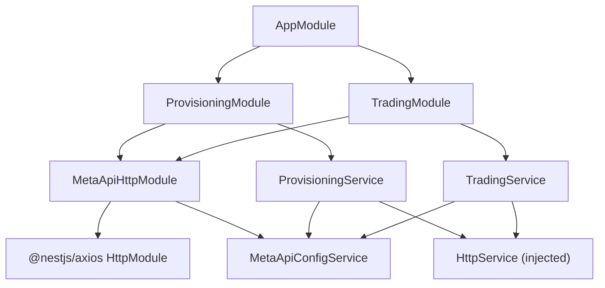
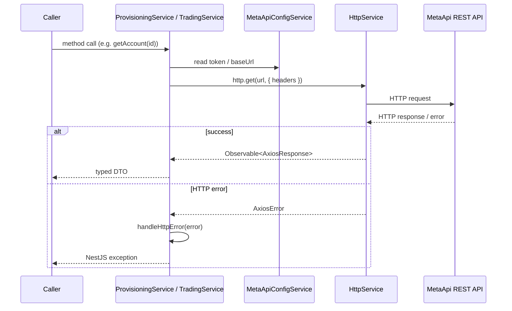

# Design Document: MetaApi MT5 Integration

## Overview

This design describes the MetaApi MT5 integration for the existing NestJS 11 backend. The integration wraps the MetaApi REST API — both the Provisioning API and the Trading (Client) API — into clean, typed NestJS modules that other parts of the application can consume via dependency injection.

The integration is organized into three layers:

1. **HTTP Layer** (`src/integrations/metaapi/`) — owns the `@nestjs/axios` HttpModule, the `MetaApiConfigService`, and centralized error handling. Nothing in this layer knows about business logic.
2. **Provisioning Layer** (`src/modules/provisioning/`) — exposes `ProvisioningService` covering all Provisioning API endpoints (account CRUD, deploy/undeploy, demo/live account creation).
3. **Trading Layer** (`src/modules/trading/`) — exposes `TradingService` covering all Trading API endpoints (account info, positions, orders, history, market data, trade execution, utilities).

The existing `src/metaapi/` folder is empty and will not be used; the new structure follows the module conventions established by `DatabaseModule`.

### Key Design Decisions

- **`@nestjs/axios` over raw `axios`**: Integrates naturally with NestJS DI, supports `HttpModule` configuration, and returns RxJS Observables that can be converted to Promises with `firstValueFrom`.
- **`MetaApiConfigService` mirrors `DatabaseConfigService`**: The project already uses a plain `@Injectable()` service that reads `process.env` directly (no `@nestjs/config`). `MetaApiConfigService` follows the same pattern.
- **Centralized error handler**: A single `handleHttpError()` utility function maps Axios HTTP errors to typed NestJS exceptions. Both `ProvisioningService` and `TradingService` call it from their `catch` blocks, keeping error logic in one place.
- **`src/metaapi/` left empty**: The existing empty folder is not removed (it may be a git-tracked placeholder), but all new code goes into `src/integrations/` and `src/modules/`.

---

## Architecture



### Request Flow



---

## Components and Interfaces

### `MetaApiHttpModule` (`src/integrations/metaapi/metaapi-http.module.ts`)

The integration module. Registers `HttpModule` with a 30-second timeout and exports both `HttpModule` and `MetaApiConfigService` so downstream modules can inject them.

```typescript
@Module({
  imports: [
    HttpModule.register({ timeout: 30000 }),
  ],
  providers: [MetaApiConfigService],
  exports: [HttpModule, MetaApiConfigService],
})
export class MetaApiHttpModule {}
```

### `MetaApiConfigService` (`src/integrations/metaapi/metaapi-config.service.ts`)

Reads and validates all MetaApi environment variables at construction time. Throws `Error` on missing required vars so the application fails fast at startup.

```typescript
@Injectable()
export class MetaApiConfigService {
  readonly provisioningToken: string;
  readonly accountToken: string;
  readonly accountId: string;
  readonly region: string;
  readonly provisioningBaseUrl: string;
  readonly tradingBaseUrl: string;
}
```

Required env vars validated at startup:
- `METAAPI_PROVISIONING_TOKEN`
- `METAAPI_ACCOUNT_TOKEN`
- `METAAPI_ACCOUNT_ID`
- `METAAPI_REGION`
- `METAAPI_PROVISIONING_BASE_URL`
- `METAAPI_TRADING_BASE_URL`

### `handleHttpError` (`src/integrations/metaapi/metaapi-error.handler.ts`)

A standalone utility function (not a service) that maps Axios errors to NestJS exceptions. Both services call this from their `catch` blocks.

```typescript
export function handleHttpError(error: unknown, logger: Logger): never
```

Mapping table:

| HTTP Status | NestJS Exception |
|---|---|
| 400 | `BadRequestException` |
| 401 | `UnauthorizedException` |
| 403 | `ForbiddenException` |
| 404 | `NotFoundException` |
| 429 | `HttpException(429)` |
| 5xx | `InternalServerErrorException` |
| Timeout (ECONNABORTED) | `RequestTimeoutException` |
| Other | `InternalServerErrorException` |

### `ProvisioningModule` (`src/modules/provisioning/provisioning.module.ts`)

```typescript
@Module({
  imports: [MetaApiHttpModule],
  providers: [ProvisioningService],
  exports: [ProvisioningService],
})
export class ProvisioningModule {}
```

### `ProvisioningService` (`src/modules/provisioning/provisioning.service.ts`)

Injects `HttpService` and `MetaApiConfigService`. All methods are `async` and use `firstValueFrom()` to convert Observables to Promises.

Public API:

```typescript
listAccounts(): Promise<MetaApiAccount[]>
getAccount(accountId: string): Promise<MetaApiAccount>
createAccount(dto: CreateAccountDto): Promise<MetaApiAccount>
updateAccount(accountId: string, dto: UpdateAccountDto): Promise<MetaApiAccount>
deleteAccount(accountId: string): Promise<void>
deployAccount(accountId: string): Promise<void>
undeployAccount(accountId: string): Promise<void>
redeployAccount(accountId: string): Promise<void>
createDemoAccount(profileId: string, dto: CreateDemoAccountDto): Promise<MetaApiAccount>
createLiveAccount(dto: CreateLiveAccountDto): Promise<MetaApiAccount>
```

### `TradingModule` (`src/modules/trading/trading.module.ts`)

```typescript
@Module({
  imports: [MetaApiHttpModule],
  providers: [TradingService],
  exports: [TradingService],
})
export class TradingModule {}
```

### `TradingService` (`src/modules/trading/trading.service.ts`)

Injects `HttpService` and `MetaApiConfigService`. Adds `auth-token` header to every request.

Public API:

```typescript
// Account
getAccountInformation(accountId: string): Promise<AccountInformation>

// Positions
getPositions(accountId: string): Promise<Position[]>
getPosition(accountId: string, positionId: string): Promise<Position>

// Orders
getOrders(accountId: string): Promise<PendingOrder[]>
getOrder(accountId: string, orderId: string): Promise<PendingOrder>

// History
getHistoryOrdersByTime(accountId: string, startTime: Date, endTime: Date): Promise<HistoryOrder[]>
getHistoryDealsByTime(accountId: string, startTime: Date, endTime: Date): Promise<Deal[]>
getHistoryOrdersByTicket(accountId: string, ticket: string): Promise<HistoryOrder[]>
getHistoryDealsByTicket(accountId: string, ticket: string): Promise<Deal[]>

// Market data
getSymbols(accountId: string): Promise<string[]>
getSymbolSpec(accountId: string, symbol: string): Promise<SymbolSpec>
getCurrentPrice(accountId: string, symbol: string): Promise<CurrentPrice>
getCandles(accountId: string, symbol: string, timeframe: string): Promise<Candle[]>
getTicks(accountId: string, symbol: string): Promise<Tick[]>
getOrderBook(accountId: string, symbol: string): Promise<OrderBook>

// Trade execution
executeTrade(accountId: string, dto: TradeDto): Promise<TradeResult>

// Utilities
getServerTime(accountId: string): Promise<ServerTime>
calculateMargin(accountId: string, dto: MarginDto): Promise<MarginResult>
getCpuCredits(accountId: string): Promise<CpuCredits>
```

---

## Data Models

All interfaces live in `src/integrations/metaapi/interfaces/` and are re-exported from an `index.ts` barrel.

### Provisioning Interfaces

```typescript
// src/integrations/metaapi/interfaces/provisioning.interfaces.ts

export interface MetaApiAccount {
  id: string;
  name: string;
  type: string;
  login: string;
  server: string;
  provisioningProfileId: string;
  magic: number;
  status: string;
  platform: string;
  connectionStatus: string;
  accessToken: string;
}

export interface CreateAccountDto {
  name: string;
  type: string;
  login: string;
  password: string;
  server: string;
  provisioningProfileId: string;
  magic?: number;
  platform?: string;
}

export interface UpdateAccountDto {
  name?: string;
  password?: string;
  server?: string;
  magic?: number;
}

export interface CreateDemoAccountDto {
  name: string;
  balance: number;
  leverage: number;
  serverName: string;
}

export interface CreateLiveAccountDto {
  name: string;
  login: string;
  password: string;
  server: string;
  provisioningProfileId: string;
  platform?: string;
}
```

### Trading Interfaces

```typescript
// src/integrations/metaapi/interfaces/trading.interfaces.ts

export interface AccountInformation {
  balance: number;
  equity: number;
  margin: number;
  freeMargin: number;
  marginLevel: number;
  currency: string;
  leverage: number;
  // additional fields passed through as-is
  [key: string]: unknown;
}

export interface Position {
  id: string;
  symbol: string;
  type: 'POSITION_TYPE_BUY' | 'POSITION_TYPE_SELL';
  volume: number;
  openPrice: number;
  currentPrice: number;
  profit: number;
  swap: number;
  [key: string]: unknown;
}

export interface PendingOrder {
  id: string;
  symbol: string;
  type: string;
  volume: number;
  openPrice: number;
  currentPrice: number;
  state: string;
  [key: string]: unknown;
}

export interface HistoryOrder {
  id: string;
  symbol: string;
  type: string;
  volume: number;
  openPrice: number;
  closePrice: number;
  state: string;
  doneTime: string;
  [key: string]: unknown;
}

export interface Deal {
  id: string;
  symbol: string;
  type: string;
  volume: number;
  price: number;
  profit: number;
  time: string;
  [key: string]: unknown;
}

export interface SymbolSpec {
  symbol: string;
  description: string;
  digits: number;
  minVolume: number;
  maxVolume: number;
  volumeStep: number;
  [key: string]: unknown;
}

export interface CurrentPrice {
  bid: number;
  ask: number;
  time: string;
}

export interface Candle {
  time: string;
  open: number;
  high: number;
  low: number;
  close: number;
  tickVolume: number;
}

export interface Tick {
  time: string;
  bid: number;
  ask: number;
}

export interface OrderBook {
  time: string;
  book: Array<{ type: string; price: number; volume: number }>;
}

export type TradeActionType =
  | 'ORDER_TYPE_BUY'
  | 'ORDER_TYPE_SELL'
  | 'ORDER_TYPE_BUY_LIMIT'
  | 'ORDER_TYPE_SELL_LIMIT'
  | 'ORDER_TYPE_BUY_STOP'
  | 'ORDER_TYPE_SELL_STOP'
  | 'POSITION_MODIFY'
  | 'POSITION_CLOSE_ID'
  | 'POSITION_CLOSE_SYMBOL'
  | 'ORDER_MODIFY'
  | 'ORDER_CANCEL';

export interface TradeDto {
  actionType: TradeActionType;
  symbol?: string;
  volume?: number;
  openPrice?: number;
  stopLoss?: number;
  takeProfit?: number;
  positionId?: string;
  orderId?: string;
  comment?: string;
}

export interface TradeResult {
  numericCode: number;
  stringCode: string;
  message: string;
  orderId?: string;
  positionId?: string;
}

export interface ServerTime {
  time: string;
  brokerTime: string;
}

export interface MarginDto {
  symbol: string;
  type: string;
  volume: number;
}

export interface MarginResult {
  margin: number;
}

export interface CpuCredits {
  cpuCredits: number;
}
```

### File Layout

```
src/
  integrations/
    metaapi/
      interfaces/
        provisioning.interfaces.ts
        trading.interfaces.ts
        index.ts
      metaapi-http.module.ts
      metaapi-config.service.ts
      metaapi-error.handler.ts
  modules/
    provisioning/
      provisioning.module.ts
      provisioning.service.ts
    trading/
      trading.module.ts
      trading.service.ts
```

---

## Correctness Properties

*A property is a characteristic or behavior that should hold true across all valid executions of a system — essentially, a formal statement about what the system should do. Properties serve as the bridge between human-readable specifications and machine-verifiable correctness guarantees.*

### Property Reflection

Before listing properties, redundancy was eliminated:

- Requirements 3.1–3.5, 4.1–4.3, 5.1, 6.1, 7.1, 7.3, 8.1, 8.3, 9.1–9.4, 10.1–10.6, 12.1–12.3 all test the same fundamental behavior: **URL construction from input parameters**. These are consolidated into two properties (one for Provisioning, one for Trading) rather than one per endpoint.
- Requirements 7.2 and 8.2 both test **response field presence** for list endpoints. These are consolidated into one property covering all list responses.
- Requirements 11.1–11.11 all test that the correct `actionType` is set in the POST body. These are consolidated into one property.
- Requirements 13.1–13.8 all test the error mapping function. These are consolidated into one property.
- Requirements 6.2 (auth-token header) is a universal property that subsumes the per-endpoint header checks.

---

### Property 1: Provisioning URL construction

*For any* valid account ID (or profile ID) passed to any `ProvisioningService` method, the HTTP request URL constructed by the service SHALL contain that exact ID at the correct path position, and the base URL SHALL match `METAAPI_PROVISIONING_BASE_URL`.

**Validates: Requirements 3.1, 3.2, 3.3, 3.4, 3.5, 4.1, 4.2, 4.3, 5.1**

---

### Property 2: Trading URL construction

*For any* valid account ID, symbol, or other path parameter passed to any `TradingService` method, the HTTP request URL constructed by the service SHALL contain those exact values at the correct path positions, and the base URL SHALL match `METAAPI_TRADING_BASE_URL`.

**Validates: Requirements 6.1, 7.1, 7.3, 8.1, 8.3, 9.1, 9.2, 9.3, 9.4, 10.1, 10.2, 10.3, 10.4, 10.5, 10.6, 12.1, 12.2, 12.3**

---

### Property 3: Auth-token header on every Trading request

*For any* `TradingService` method call, the outbound HTTP request SHALL include an `auth-token` header whose value equals the `METAAPI_ACCOUNT_TOKEN` environment variable.

**Validates: Requirements 6.2**

---

### Property 4: Response passthrough preserves required fields

*For any* API response object returned by the MetaApi REST API, the corresponding service method SHALL return an object that contains all required fields specified for that response type (e.g., `balance`, `equity`, `margin`, `freeMargin`, `marginLevel`, `currency`, `leverage` for account information; `id`, `symbol`, `type`, `volume`, `openPrice`, `currentPrice`, `profit`, `swap` for positions).

**Validates: Requirements 6.3, 7.2, 8.2**

---

### Property 5: Trade action type correctness

*For any* trade request submitted through `TradingService`, the `actionType` field in the POST body sent to `/trade` SHALL exactly match the action type corresponding to the method called (e.g., `executeTrade` with `ORDER_TYPE_BUY` always sends `actionType: "ORDER_TYPE_BUY"`).

**Validates: Requirements 11.1, 11.2, 11.3, 11.4, 11.5, 11.6, 11.7, 11.8, 11.9, 11.10, 11.11**

---

### Property 6: HTTP error status code mapping

*For any* HTTP error response with a status code in {400, 401, 403, 404, 429, 500, 502, 503}, the `handleHttpError` function SHALL throw the corresponding NestJS exception type, and the exception message SHALL contain the original API error message from the response body.

**Validates: Requirements 3.6, 4.4, 13.1, 13.2, 13.3, 13.4, 13.5, 13.6, 13.7**

---

### Property 7: History time range validation

*For any* pair of timestamps where `startTime > endTime`, calling `getHistoryOrdersByTime` or `getHistoryDealsByTime` SHALL throw a validation error and SHALL NOT make any outbound HTTP request.

**Validates: Requirements 9.5**

---

### Property 8: Live account creation always sets type to "cloud"

*For any* live account creation payload passed to `createLiveAccount`, the POST request body sent to the Provisioning API SHALL always contain `type: "cloud"`, regardless of what other fields are in the payload.

**Validates: Requirements 5.2**

---

## Error Handling

### Error Handler Implementation

```typescript
// src/integrations/metaapi/metaapi-error.handler.ts
import {
  BadRequestException,
  ForbiddenException,
  HttpException,
  InternalServerErrorException,
  Logger,
  NotFoundException,
  RequestTimeoutException,
  UnauthorizedException,
} from '@nestjs/common';
import { AxiosError } from 'axios';

export function handleHttpError(error: unknown, logger: Logger): never {
  if (error instanceof AxiosError) {
    const status = error.response?.status;
    const message = error.response?.data?.message ?? error.message;

    logger.error(`MetaApi HTTP error: ${status} — ${message}`, error.stack);

    if (error.code === 'ECONNABORTED') {
      throw new RequestTimeoutException('MetaApi request timed out');
    }

    switch (status) {
      case 400: throw new BadRequestException(message);
      case 401: throw new UnauthorizedException('Invalid or expired MetaApi credentials');
      case 403: throw new ForbiddenException(message);
      case 404: throw new NotFoundException(message);
      case 429: throw new HttpException('MetaApi rate limit exceeded', 429);
      default:
        if (status && status >= 500) {
          throw new InternalServerErrorException(message);
        }
        throw new InternalServerErrorException(`Unexpected MetaApi error: ${message}`);
    }
  }

  logger.error('Unknown MetaApi error', error);
  throw new InternalServerErrorException('Unknown MetaApi error');
}
```

### Service-Level Error Handling Pattern

Every service method wraps its HTTP call in a try/catch:

```typescript
async getAccount(accountId: string): Promise<MetaApiAccount> {
  try {
    const response = await firstValueFrom(
      this.httpService.get<MetaApiAccount>(
        `${this.config.provisioningBaseUrl}/users/current/accounts/${accountId}`,
        { headers: { 'auth-token': this.config.provisioningToken } },
      ),
    );
    return response.data;
  } catch (error) {
    handleHttpError(error, this.logger);
  }
}
```

### Validation Errors

Input validation (missing required fields, invalid time ranges) is thrown as `BadRequestException` before any HTTP call is made. This keeps validation logic in the service layer, not the error handler.

---

## Testing Strategy

### Unit Tests

Unit tests use Jest (already configured) with mocked `HttpService` and `MetaApiConfigService`. Each service method gets at least one success-path test and one error-path test.

Focus areas:
- `MetaApiConfigService`: validates that missing env vars throw at construction time (one test per required var).
- `handleHttpError`: one test per HTTP status code in the mapping table, plus timeout and unknown error cases.
- `ProvisioningService`: success path for each method (mock returns expected data, verify URL and headers); error path delegates to `handleHttpError`.
- `TradingService`: same pattern as `ProvisioningService`; additionally verify `auth-token` header is present on every call.

### Property-Based Tests

Property-based testing is appropriate here because the core behaviors (URL construction, header injection, error mapping, response passthrough) are pure functions that vary meaningfully with input. The project uses Jest; [fast-check](https://github.com/dubzzz/fast-check) will be added as a dev dependency.

Each property test runs a minimum of 100 iterations.

**Tag format**: `// Feature: metaapi-integration, Property {N}: {property_text}`

| Property | Test file | fast-check generators |
|---|---|---|
| P1: Provisioning URL construction | `provisioning.service.spec.ts` | `fc.string()` for accountId/profileId |
| P2: Trading URL construction | `trading.service.spec.ts` | `fc.string()` for accountId/symbol/timeframe |
| P3: Auth-token header | `trading.service.spec.ts` | `fc.string()` for token value |
| P4: Response field presence | `trading.service.spec.ts` | `fc.record()` for response objects |
| P5: Trade action type | `trading.service.spec.ts` | `fc.constantFrom(...actionTypes)` |
| P6: Error status mapping | `metaapi-error.handler.spec.ts` | `fc.constantFrom(400, 401, 403, 404, 429, 500, 502, 503)` |
| P7: Time range validation | `trading.service.spec.ts` | `fc.date()` pairs where start > end |
| P8: Live account type field | `provisioning.service.spec.ts` | `fc.record()` for live account payload |

### Integration Tests

Not included in this feature's scope. Integration tests against the live MetaApi sandbox would be a separate concern and are not cost-effective to run in CI.

### Test File Locations

Following the project's existing pattern (`src/**/__tests__/*.spec.ts` or `src/**/*.spec.ts`):

```
src/
  integrations/
    metaapi/
      metaapi-config.service.spec.ts
      metaapi-error.handler.spec.ts
  modules/
    provisioning/
      provisioning.service.spec.ts
    trading/
      trading.service.spec.ts
```
