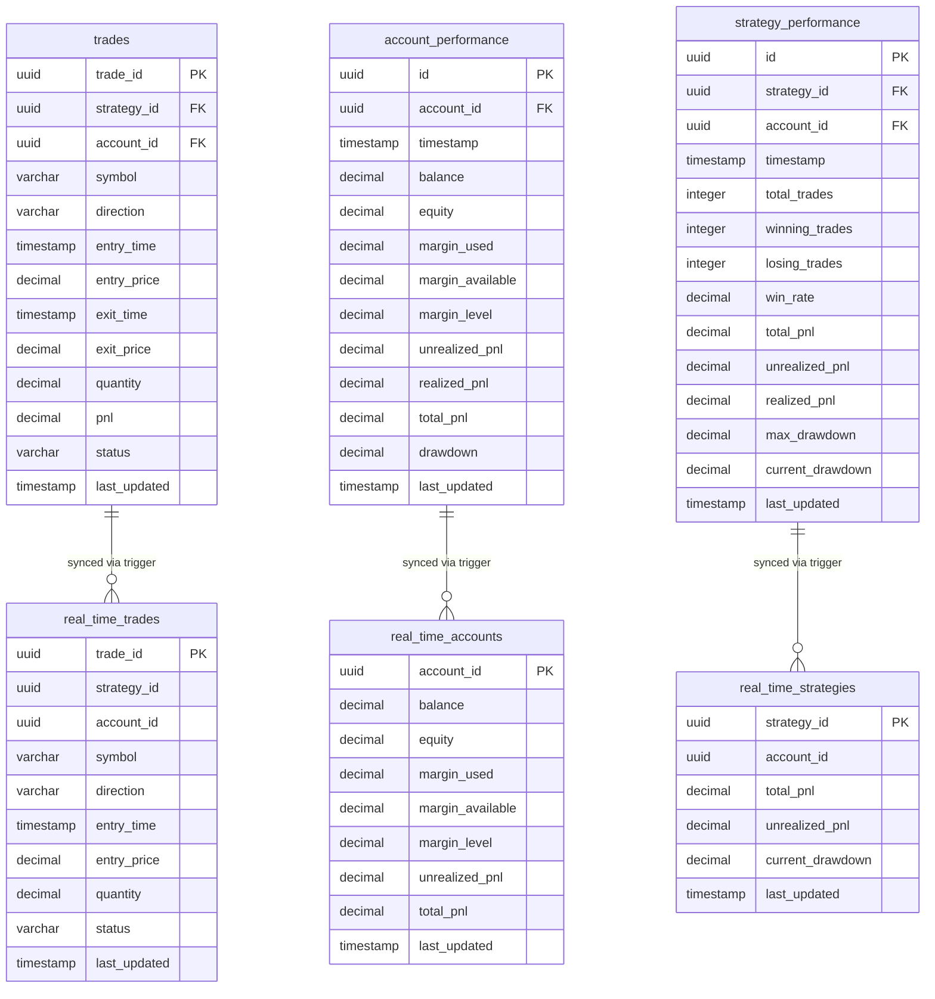

# Design Document: Real-Time Trading Performance Database Schema

## Overview

This design specifies a PostgreSQL database schema optimized for real-time trading performance monitoring with historical analytics capabilities. The schema addresses performance issues from previous implementations by introducing a dual-table architecture: historical tables for analytics and dedicated real-time tables for sub-second granularity live dashboards.

### Key Design Decisions

1. **Dual-Table Architecture**: Separate historical and real-time tables to optimize for different access patterns
   - Historical tables (`trades`, `account_performance`, `strategy_performance`) store all records indefinitely for analytics
   - Real-time tables (`real_time_trades`, `real_time_accounts`, `real_time_strategies`) store only current state for live dashboards
   - Automatic synchronization via PostgreSQL triggers eliminates manual sync logic

2. **Optimized Indexing Strategy**: Maximum 5 indexes per table, prioritizing frequent query patterns
   - Composite indexes for multi-column filters (e.g., `account_id + status`)
   - Partial indexes for frequently filtered subsets (e.g., `status = 'open'`)
   - Index-only scans on real-time tables for sub-50ms query performance

3. **Automatic Timestamp Management**: PostgreSQL triggers handle `last_updated` fields
   - Eliminates application-level timestamp logic
   - Ensures consistency across all updates
   - Enables efficient "latest state" queries

4. **Sequelize ORM Integration**: Type-safe models with TypeScript definitions
   - Leverages existing Sequelize setup from `sequelize-orm-setup` spec
   - Extends `BaseModel` for common fields (id, createdAt, updatedAt, deletedAt)
   - Migration-based schema management for version control

### Performance Targets

- Open trades query: < 100ms for accounts with up to 1000 open trades
- Current account equity query: < 50ms
- Current strategy performance query: < 50ms
- Real-time table updates: Sub-second granularity

## Architecture

### Database Layer

```
┌─────────────────────────────────────────────────────────────┐
│                    PostgreSQL Database                       │
├─────────────────────────────────────────────────────────────┤
│                                                               │
│  Historical Tables (Analytics)      Real-Time Tables (Live)  │
│  ┌──────────────────────┐          ┌────────────────────┐   │
│  │ trades               │          │ real_time_trades   │   │
│  │ - All trade records  │◄─────────│ - Open trades only │   │
│  │ - Indefinite storage │ Trigger  │ - 24hr closed      │   │
│  └──────────────────────┘          └────────────────────┘   │
│                                                               │
│  ┌──────────────────────┐          ┌────────────────────┐   │
│  │ account_performance  │          │ real_time_accounts │   │
│  │ - All snapshots      │◄─────────│ - Latest state only│   │
│  │ - Intraday + EOD     │ Trigger  │ - 1 row per account│   │
│  └──────────────────────┘          └────────────────────┘   │
│                                                               │
│  ┌──────────────────────┐          ┌────────────────────┐   │
│  │ strategy_performance │          │real_time_strategies│   │
│  │ - All snapshots      │◄─────────│ - Latest state only│   │
│  │ - Intraday + EOD     │ Trigger  │ - 1 row per strat  │   │
│  └──────────────────────┘          └────────────────────┘   │
│                                                               │
│  Trigger Functions:                                          │
│  - update_last_updated_column()                              │
│  - sync_real_time_trades()                                   │
│  - sync_real_time_accounts()                                 │
│  - sync_real_time_strategies()                               │
└─────────────────────────────────────────────────────────────┘
```

### Application Layer (NestJS + Sequelize)

```
┌─────────────────────────────────────────────────────────────┐
│                    NestJS Application                        │
├─────────────────────────────────────────────────────────────┤
│                                                               │
│  Sequelize Models (TypeScript)                               │
│  ┌──────────────────────────────────────────────────────┐   │
│  │ Trade extends BaseModel                              │   │
│  │ AccountPerformance extends BaseModel                 │   │
│  │ StrategyPerformance extends BaseModel                │   │
│  │ RealTimeTrade extends BaseModel                      │   │
│  │ RealTimeAccount extends BaseModel                    │   │
│  │ RealTimeStrategy extends BaseModel                   │   │
│  └──────────────────────────────────────────────────────┘   │
│                                                               │
│  Services (Business Logic)                                   │
│  ┌──────────────────────────────────────────────────────┐   │
│  │ - Write to historical tables                         │   │
│  │ - Read from real-time tables for live dashboards     │   │
│  │ - Read from historical tables for analytics          │   │
│  │ - Triggers handle synchronization automatically      │   │
│  └──────────────────────────────────────────────────────┘   │
└─────────────────────────────────────────────────────────────┘
```

### Data Flow

1. **Trade Execution Flow**:
   - Application inserts/updates trade in `trades` table
   - PostgreSQL trigger automatically updates `last_updated` timestamp
   - PostgreSQL trigger automatically syncs to `real_time_trades` table
   - Live dashboard queries `real_time_trades` for sub-second updates

2. **Performance Snapshot Flow**:
   - Application inserts performance snapshot in `account_performance` or `strategy_performance`
   - PostgreSQL trigger automatically updates `last_updated` timestamp
   - PostgreSQL trigger automatically upserts to `real_time_accounts` or `real_time_strategies`
   - Live dashboard queries real-time tables for current state
   - Analytics queries historical tables for trends

3. **Real-Time Table Cleanup**:
   - Closed trades older than 24 hours are removed from `real_time_trades` (via trigger or scheduled job)
   - Real-time account/strategy tables maintain only latest state (upsert pattern)

## Components and Interfaces

### Database Tables

#### 1. trades (Historical Trade Records)

**Purpose**: Store all trade executions with entry, exit, and PnL details for historical analysis.

**Schema**:
```sql
CREATE TABLE trades (
  trade_id UUID PRIMARY KEY DEFAULT gen_random_uuid(),
  strategy_id UUID NOT NULL,
  account_id UUID NOT NULL,
  symbol VARCHAR(20) NOT NULL,
  direction VARCHAR(10) NOT NULL CHECK (direction IN ('long', 'short')),
  entry_time TIMESTAMP NOT NULL,
  entry_price DECIMAL(18, 8) NOT NULL,
  exit_time TIMESTAMP,
  exit_price DECIMAL(18, 8),
  quantity DECIMAL(18, 8) NOT NULL,
  pnl DECIMAL(18, 8),
  status VARCHAR(20) NOT NULL CHECK (status IN ('open', 'closed', 'cancelled')),
  last_updated TIMESTAMP NOT NULL DEFAULT CURRENT_TIMESTAMP,
  created_at TIMESTAMP NOT NULL DEFAULT CURRENT_TIMESTAMP,
  updated_at TIMESTAMP NOT NULL DEFAULT CURRENT_TIMESTAMP
);
```

**Indexes**:
1. `idx_trades_account_status` on `(account_id, status)` - Query open trades by account
2. `idx_trades_strategy_status` on `(strategy_id, status)` - Query open trades by strategy
3. `idx_trades_last_updated` on `(last_updated DESC)` - Retrieve recently updated trades
4. `idx_trades_entry_time` on `(entry_time DESC)` - Historical analysis by time
5. `idx_trades_symbol` on `(symbol)` - Filter trades by symbol

**Rationale**: Composite indexes on `(account_id, status)` and `(strategy_id, status)` support the most frequent query pattern: "get all open trades for account/strategy". The `last_updated` index enables efficient "recent changes" queries. Entry time index supports historical analytics.

#### 2. account_performance (Historical Account Snapshots)

**Purpose**: Store intraday and end-of-day snapshots of account equity, margin, and PnL for trend analysis.

**Schema**:
```sql
CREATE TABLE account_performance (
  id UUID PRIMARY KEY DEFAULT gen_random_uuid(),
  account_id UUID NOT NULL,
  timestamp TIMESTAMP NOT NULL,
  balance DECIMAL(18, 8) NOT NULL,
  equity DECIMAL(18, 8) NOT NULL,
  margin_used DECIMAL(18, 8) NOT NULL,
  margin_available DECIMAL(18, 8) NOT NULL,
  margin_level DECIMAL(10, 4) NOT NULL CHECK (margin_level >= 0 AND margin_level <= 1000),
  unrealized_pnl DECIMAL(18, 8) NOT NULL,
  realized_pnl DECIMAL(18, 8) NOT NULL,
  total_pnl DECIMAL(18, 8) NOT NULL,
  drawdown DECIMAL(10, 4) NOT NULL,
  last_updated TIMESTAMP NOT NULL DEFAULT CURRENT_TIMESTAMP,
  created_at TIMESTAMP NOT NULL DEFAULT CURRENT_TIMESTAMP,
  updated_at TIMESTAMP NOT NULL DEFAULT CURRENT_TIMESTAMP
);
```

**Indexes**:
1. `idx_account_perf_account_last_updated` on `(account_id, last_updated DESC)` - Latest state query
2. `idx_account_perf_account_timestamp` on `(account_id, timestamp DESC)` - Historical analysis
3. `idx_account_perf_timestamp` on `(timestamp DESC)` - Time-based queries across accounts

**Rationale**: The `(account_id, last_updated)` composite index enables sub-50ms "current equity" queries. The `(account_id, timestamp)` index supports historical trend analysis. Limited to 3 indexes to minimize write overhead.

#### 3. strategy_performance (Historical Strategy Snapshots)

**Purpose**: Store intraday and end-of-day snapshots of strategy-level performance metrics.

**Schema**:
```sql
CREATE TABLE strategy_performance (
  id UUID PRIMARY KEY DEFAULT gen_random_uuid(),
  strategy_id UUID NOT NULL,
  account_id UUID NOT NULL,
  timestamp TIMESTAMP NOT NULL,
  total_trades INTEGER NOT NULL DEFAULT 0,
  winning_trades INTEGER NOT NULL DEFAULT 0,
  losing_trades INTEGER NOT NULL DEFAULT 0,
  win_rate DECIMAL(5, 4) NOT NULL DEFAULT 0,
  total_pnl DECIMAL(18, 8) NOT NULL DEFAULT 0,
  unrealized_pnl DECIMAL(18, 8) NOT NULL DEFAULT 0,
  realized_pnl DECIMAL(18, 8) NOT NULL DEFAULT 0,
  max_drawdown DECIMAL(10, 4) NOT NULL DEFAULT 0,
  current_drawdown DECIMAL(10, 4) NOT NULL DEFAULT 0,
  last_updated TIMESTAMP NOT NULL DEFAULT CURRENT_TIMESTAMP,
  created_at TIMESTAMP NOT NULL DEFAULT CURRENT_TIMESTAMP,
  updated_at TIMESTAMP NOT NULL DEFAULT CURRENT_TIMESTAMP
);
```

**Indexes**:
1. `idx_strategy_perf_strategy_last_updated` on `(strategy_id, last_updated DESC)` - Latest state query
2. `idx_strategy_perf_account_strategy_timestamp` on `(account_id, strategy_id, timestamp DESC)` - Historical analysis
3. `idx_strategy_perf_timestamp` on `(timestamp DESC)` - Time-based queries across strategies

**Rationale**: Similar to account_performance, the `(strategy_id, last_updated)` index enables sub-50ms current state queries. The composite `(account_id, strategy_id, timestamp)` index supports multi-dimensional historical analysis.

#### 4. real_time_trades (Live Trade Monitoring)

**Purpose**: Store only open trades and recently closed trades (24hr window) for live dashboard queries.

**Schema**:
```sql
CREATE TABLE real_time_trades (
  trade_id UUID PRIMARY KEY,
  strategy_id UUID NOT NULL,
  account_id UUID NOT NULL,
  symbol VARCHAR(20) NOT NULL,
  direction VARCHAR(10) NOT NULL CHECK (direction IN ('long', 'short')),
  entry_time TIMESTAMP NOT NULL,
  entry_price DECIMAL(18, 8) NOT NULL,
  quantity DECIMAL(18, 8) NOT NULL,
  status VARCHAR(20) NOT NULL CHECK (status IN ('open', 'closed', 'cancelled')),
  last_updated TIMESTAMP NOT NULL DEFAULT CURRENT_TIMESTAMP
);
```

**Indexes**:
1. `idx_rt_trades_account_status` on `(account_id, status)` - Query open trades by account
2. `idx_rt_trades_strategy_status` on `(strategy_id, status)` - Query open trades by strategy
3. `idx_rt_trades_last_updated` on `(last_updated DESC)` - Recently updated trades

**Rationale**: Minimal columns (no exit_price, pnl) to reduce storage and improve query speed. Same index strategy as historical `trades` table but with smaller dataset for faster scans.

#### 5. real_time_accounts (Live Account Monitoring)

**Purpose**: Store only the most recent state for each account (single row per account).

**Schema**:
```sql
CREATE TABLE real_time_accounts (
  account_id UUID PRIMARY KEY,
  balance DECIMAL(18, 8) NOT NULL,
  equity DECIMAL(18, 8) NOT NULL,
  margin_used DECIMAL(18, 8) NOT NULL,
  margin_available DECIMAL(18, 8) NOT NULL,
  margin_level DECIMAL(10, 4) NOT NULL CHECK (margin_level >= 0 AND margin_level <= 1000),
  unrealized_pnl DECIMAL(18, 8) NOT NULL,
  total_pnl DECIMAL(18, 8) NOT NULL,
  last_updated TIMESTAMP NOT NULL DEFAULT CURRENT_TIMESTAMP
);
```

**Indexes**:
1. Primary key on `account_id` (automatic index) - Direct lookup by account

**Rationale**: Single row per account means primary key index is sufficient. No additional indexes needed. Queries are simple primary key lookups with sub-50ms performance.

#### 6. real_time_strategies (Live Strategy Monitoring)

**Purpose**: Store only the most recent state for each strategy (single row per strategy).

**Schema**:
```sql
CREATE TABLE real_time_strategies (
  strategy_id UUID PRIMARY KEY,
  account_id UUID NOT NULL,
  total_pnl DECIMAL(18, 8) NOT NULL DEFAULT 0,
  unrealized_pnl DECIMAL(18, 8) NOT NULL DEFAULT 0,
  current_drawdown DECIMAL(10, 4) NOT NULL DEFAULT 0,
  last_updated TIMESTAMP NOT NULL DEFAULT CURRENT_TIMESTAMP
);
```

**Indexes**:
1. Primary key on `strategy_id` (automatic index) - Direct lookup by strategy
2. `idx_rt_strategies_account` on `(account_id)` - Query all strategies for an account

**Rationale**: Primary key index for direct strategy lookup. Additional index on `account_id` to support "all strategies for account" queries common in dashboards.

### Trigger Functions

#### 1. update_last_updated_column()

**Purpose**: Automatically set `last_updated` to current timestamp on UPDATE operations.

**Implementation**:
```sql
CREATE OR REPLACE FUNCTION update_last_updated_column()
RETURNS TRIGGER AS $$
BEGIN
  NEW.last_updated = CURRENT_TIMESTAMP;
  RETURN NEW;
END;
$$ LANGUAGE plpgsql;
```

**Attached to**:
- `trades` (BEFORE UPDATE)
- `account_performance` (BEFORE UPDATE)
- `strategy_performance` (BEFORE UPDATE)

**Rationale**: Eliminates application-level timestamp management. Ensures consistency across all updates. Enables efficient "latest state" queries using `ORDER BY last_updated DESC LIMIT 1`.

#### 2. sync_real_time_trades()

**Purpose**: Automatically synchronize `trades` to `real_time_trades` on INSERT and UPDATE.

**Implementation**:
```sql
CREATE OR REPLACE FUNCTION sync_real_time_trades()
RETURNS TRIGGER AS $$
BEGIN
  -- Insert or update real-time trade
  INSERT INTO real_time_trades (
    trade_id, strategy_id, account_id, symbol, direction,
    entry_time, entry_price, quantity, status, last_updated
  ) VALUES (
    NEW.trade_id, NEW.strategy_id, NEW.account_id, NEW.symbol, NEW.direction,
    NEW.entry_time, NEW.entry_price, NEW.quantity, NEW.status, NEW.last_updated
  )
  ON CONFLICT (trade_id) DO UPDATE SET
    status = EXCLUDED.status,
    last_updated = EXCLUDED.last_updated;
  
  -- Remove closed trades older than 24 hours
  DELETE FROM real_time_trades
  WHERE status IN ('closed', 'cancelled')
    AND last_updated < CURRENT_TIMESTAMP - INTERVAL '24 hours';
  
  RETURN NEW;
END;
$$ LANGUAGE plpgsql;
```

**Attached to**:
- `trades` (AFTER INSERT OR UPDATE)

**Rationale**: Automatic synchronization eliminates manual sync logic. Cleanup of old closed trades keeps real-time table small for fast queries. 24-hour retention allows recent trade review.

#### 3. sync_real_time_accounts()

**Purpose**: Automatically synchronize `account_performance` to `real_time_accounts` on INSERT and UPDATE.

**Implementation**:
```sql
CREATE OR REPLACE FUNCTION sync_real_time_accounts()
RETURNS TRIGGER AS $$
BEGIN
  -- Upsert latest account state
  INSERT INTO real_time_accounts (
    account_id, balance, equity, margin_used, margin_available,
    margin_level, unrealized_pnl, total_pnl, last_updated
  ) VALUES (
    NEW.account_id, NEW.balance, NEW.equity, NEW.margin_used, NEW.margin_available,
    NEW.margin_level, NEW.unrealized_pnl, NEW.total_pnl, NEW.last_updated
  )
  ON CONFLICT (account_id) DO UPDATE SET
    balance = EXCLUDED.balance,
    equity = EXCLUDED.equity,
    margin_used = EXCLUDED.margin_used,
    margin_available = EXCLUDED.margin_available,
    margin_level = EXCLUDED.margin_level,
    unrealized_pnl = EXCLUDED.unrealized_pnl,
    total_pnl = EXCLUDED.total_pnl,
    last_updated = EXCLUDED.last_updated;
  
  RETURN NEW;
END;
$$ LANGUAGE plpgsql;
```

**Attached to**:
- `account_performance` (AFTER INSERT OR UPDATE)

**Rationale**: Upsert pattern maintains single row per account. Always reflects latest state. No cleanup needed since old states are replaced, not accumulated.

#### 4. sync_real_time_strategies()

**Purpose**: Automatically synchronize `strategy_performance` to `real_time_strategies` on INSERT and UPDATE.

**Implementation**:
```sql
CREATE OR REPLACE FUNCTION sync_real_time_strategies()
RETURNS TRIGGER AS $$
BEGIN
  -- Upsert latest strategy state
  INSERT INTO real_time_strategies (
    strategy_id, account_id, total_pnl, unrealized_pnl,
    current_drawdown, last_updated
  ) VALUES (
    NEW.strategy_id, NEW.account_id, NEW.total_pnl, NEW.unrealized_pnl,
    NEW.current_drawdown, NEW.last_updated
  )
  ON CONFLICT (strategy_id) DO UPDATE SET
    account_id = EXCLUDED.account_id,
    total_pnl = EXCLUDED.total_pnl,
    unrealized_pnl = EXCLUDED.unrealized_pnl,
    current_drawdown = EXCLUDED.current_drawdown,
    last_updated = EXCLUDED.last_updated;
  
  RETURN NEW;
END;
$$ LANGUAGE plpgsql;
```

**Attached to**:
- `strategy_performance` (AFTER INSERT OR UPDATE)

**Rationale**: Same upsert pattern as accounts. Maintains single row per strategy with latest state.

### Sequelize Models

All models extend `BaseModel` which provides:
- `id` (UUID primary key)
- `createdAt` (automatic timestamp)
- `updatedAt` (automatic timestamp)
- `deletedAt` (soft delete support)

#### 1. Trade Model

**File**: `src/database/models/trade.model.ts`

**Purpose**: ORM representation of `trades` table with TypeScript types and relationships.

**Key Features**:
- Enum types for `direction` ('long' | 'short') and `status` ('open' | 'closed' | 'cancelled')
- Decimal precision for prices and quantities
- Automatic timestamp management via triggers
- Foreign key relationships to accounts and strategies (when those models exist)

#### 2. AccountPerformance Model

**File**: `src/database/models/account-performance.model.ts`

**Purpose**: ORM representation of `account_performance` table.

**Key Features**:
- Decimal precision for financial metrics
- Validation for margin_level (0-1000 range)
- Composite queries for historical analysis

#### 3. StrategyPerformance Model

**File**: `src/database/models/strategy-performance.model.ts`

**Purpose**: ORM representation of `strategy_performance` table.

**Key Features**:
- Integer counters for trade statistics
- Decimal precision for PnL and drawdown metrics
- Composite queries for multi-dimensional analysis

#### 4. RealTimeTrade Model

**File**: `src/database/models/real-time-trade.model.ts`

**Purpose**: ORM representation of `real_time_trades` table for live dashboard queries.

**Key Features**:
- Minimal fields for fast queries
- Read-only from application perspective (managed by triggers)
- Optimized for status filtering

#### 5. RealTimeAccount Model

**File**: `src/database/models/real-time-account.model.ts`

**Purpose**: ORM representation of `real_time_accounts` table for live account monitoring.

**Key Features**:
- Single row per account
- Read-only from application perspective
- Primary key lookups only

#### 6. RealTimeStrategy Model

**File**: `src/database/models/real-time-strategy.model.ts`

**Purpose**: ORM representation of `real_time_strategies` table for live strategy monitoring.

**Key Features**:
- Single row per strategy
- Read-only from application perspective
- Support for account-level aggregation queries

## Data Models

### Entity Relationship Diagram



### Data Type Specifications

#### Numeric Precision

- **Prices and PnL**: `DECIMAL(18, 8)` - 18 total digits, 8 decimal places
  - Supports prices from 0.00000001 to 9999999999.99999999
  - Sufficient for cryptocurrency and forex precision
  
- **Quantities**: `DECIMAL(18, 8)` - Same precision as prices
  - Supports fractional shares and crypto amounts
  
- **Percentages** (margin_level, drawdown, win_rate): `DECIMAL(10, 4)` or `DECIMAL(5, 4)`
  - margin_level: 10 digits total, 4 decimal places (supports 0.0000% to 999999.9999%)
  - drawdown: 10 digits total, 4 decimal places
  - win_rate: 5 digits total, 4 decimal places (supports 0.0000 to 1.0000)

#### Timestamp Handling

- **entry_time, exit_time, timestamp**: `TIMESTAMP WITHOUT TIME ZONE`
  - Stores UTC timestamps
  - Application layer handles timezone conversion
  
- **last_updated**: `TIMESTAMP WITHOUT TIME ZONE`
  - Automatically managed by triggers
  - Uses `CURRENT_TIMESTAMP` (UTC)

#### String Constraints

- **symbol**: `VARCHAR(20)` - Supports stock tickers, forex pairs, crypto symbols
- **direction**: `VARCHAR(10)` - 'long' or 'short'
- **status**: `VARCHAR(20)` - 'open', 'closed', 'cancelled'

### Data Integrity Constraints

#### Primary Keys

- `trades.trade_id` - UUID, auto-generated
- `account_performance.id` - UUID, auto-generated
- `strategy_performance.id` - UUID, auto-generated
- `real_time_trades.trade_id` - UUID, references trades.trade_id
- `real_time_accounts.account_id` - UUID
- `real_time_strategies.strategy_id` - UUID

#### Foreign Keys

- `trades.strategy_id` - References strategies table (when implemented)
- `trades.account_id` - References accounts table (when implemented)
- `strategy_performance.strategy_id` - References strategies table
- `strategy_performance.account_id` - References accounts table
- `account_performance.account_id` - References accounts table

**Note**: Foreign key constraints will be added when account and strategy tables are implemented in future specs.

#### Check Constraints

- `trades.direction IN ('long', 'short')`
- `trades.status IN ('open', 'closed', 'cancelled')`
- `account_performance.margin_level >= 0 AND margin_level <= 1000`
- `real_time_trades.direction IN ('long', 'short')`
- `real_time_trades.status IN ('open', 'closed', 'cancelled')`
- `real_time_accounts.margin_level >= 0 AND margin_level <= 1000`

#### Not Null Constraints

- All `account_id`, `strategy_id`, `symbol`, `entry_time`, `entry_price`, `quantity` fields are NOT NULL
- All `last_updated` fields are NOT NULL
- All performance metric fields have NOT NULL with DEFAULT values

### Query Patterns and Index Usage

#### Pattern 1: Get Open Trades for Account

```sql
SELECT * FROM real_time_trades
WHERE account_id = ? AND status = 'open'
ORDER BY last_updated DESC;
```

**Index Used**: `idx_rt_trades_account_status` on `(account_id, status)`

**Performance**: < 100ms for up to 1000 open trades

#### Pattern 2: Get Current Account Equity

```sql
SELECT * FROM real_time_accounts
WHERE account_id = ?;
```

**Index Used**: Primary key on `account_id`

**Performance**: < 50ms (single row lookup)

#### Pattern 3: Get Current Strategy Performance

```sql
SELECT * FROM real_time_strategies
WHERE strategy_id = ?;
```

**Index Used**: Primary key on `strategy_id`

**Performance**: < 50ms (single row lookup)

#### Pattern 4: Get Historical Account Performance

```sql
SELECT * FROM account_performance
WHERE account_id = ?
  AND timestamp >= ?
  AND timestamp <= ?
ORDER BY timestamp DESC;
```

**Index Used**: `idx_account_perf_account_timestamp` on `(account_id, timestamp DESC)`

**Performance**: Depends on time range, optimized for common ranges (day, week, month)

#### Pattern 5: Get Recently Updated Trades

```sql
SELECT * FROM trades
WHERE last_updated >= ?
ORDER BY last_updated DESC;
```

**Index Used**: `idx_trades_last_updated` on `(last_updated DESC)`

**Performance**: Fast for recent time windows (last hour, last day)


## Error Handling

### Database-Level Error Handling

#### 1. Constraint Violations

**Check Constraint Violations**:
- **Error**: `CHECK constraint "trades_direction_check" violated`
- **Cause**: Attempting to insert direction value other than 'long' or 'short'
- **Handling**: PostgreSQL rejects the operation and returns error to application
- **Application Response**: Validate direction enum before database operation

**Foreign Key Violations**:
- **Error**: `Foreign key constraint "trades_account_id_fkey" violated`
- **Cause**: Attempting to insert trade with non-existent account_id
- **Handling**: PostgreSQL rejects the operation
- **Application Response**: Verify account exists before creating trade

**Not Null Violations**:
- **Error**: `NULL value in column "symbol" violates not-null constraint`
- **Cause**: Missing required field in INSERT operation
- **Handling**: PostgreSQL rejects the operation
- **Application Response**: Validate required fields before database operation

#### 2. Trigger Execution Errors

**Trigger Function Failures**:
- **Error**: Trigger function `sync_real_time_trades()` raises exception
- **Cause**: Unexpected data state or constraint violation in real-time table
- **Handling**: PostgreSQL rolls back the entire transaction (main table + real-time table)
- **Application Response**: Log error details, retry operation, alert monitoring system

**Deadlock in Trigger**:
- **Error**: `deadlock detected` during concurrent updates
- **Cause**: Multiple transactions updating same real-time table rows simultaneously
- **Handling**: PostgreSQL aborts one transaction and rolls back
- **Application Response**: Implement retry logic with exponential backoff

#### 3. Index-Related Errors

**Unique Constraint Violations**:
- **Error**: `duplicate key value violates unique constraint "trades_pkey"`
- **Cause**: Attempting to insert trade with existing trade_id
- **Handling**: PostgreSQL rejects the operation
- **Application Response**: Use database-generated UUIDs to avoid collisions

**Index Corruption** (rare):
- **Error**: `index "idx_trades_account_status" is corrupted`
- **Cause**: Hardware failure, power loss, or PostgreSQL bug
- **Handling**: Database administrator must REINDEX
- **Application Response**: Query may fail or return incorrect results; monitoring alerts DBA

### Application-Level Error Handling

#### 1. Connection Errors

**Connection Pool Exhausted**:
- **Error**: Sequelize throws `ConnectionAcquireTimeoutError`
- **Cause**: All 20 connections in pool are in use
- **Handling**: Application waits for connection (30s timeout)
- **Mitigation**: Monitor connection pool usage, increase pool size if needed, optimize query performance

**Connection Lost**:
- **Error**: Sequelize throws `ConnectionError` or `ECONNREFUSED`
- **Cause**: Database server unreachable (network issue, server down)
- **Handling**: Application logs error, returns 503 Service Unavailable to client
- **Mitigation**: Implement health checks, automatic reconnection, circuit breaker pattern

#### 2. Query Timeout Errors

**Statement Timeout**:
- **Error**: `QueryTimeoutError: Query execution exceeded 30000ms`
- **Cause**: Query takes longer than configured timeout (30 seconds)
- **Handling**: PostgreSQL cancels query, Sequelize throws error
- **Mitigation**: Optimize query with proper indexes, reduce data volume, increase timeout for specific queries

**Lock Wait Timeout**:
- **Error**: `lock timeout exceeded`
- **Cause**: Transaction waiting for row lock held by another transaction
- **Handling**: PostgreSQL aborts transaction
- **Mitigation**: Keep transactions short, use appropriate isolation levels, implement retry logic

#### 3. Data Validation Errors

**Invalid Decimal Precision**:
- **Error**: Sequelize validation error or PostgreSQL numeric overflow
- **Cause**: Price or quantity exceeds DECIMAL(18, 8) precision
- **Handling**: Sequelize rejects before sending to database, or PostgreSQL rejects
- **Mitigation**: Validate numeric ranges in application layer before database operation

**Invalid Timestamp**:
- **Error**: `invalid input syntax for type timestamp`
- **Cause**: Malformed timestamp string
- **Handling**: PostgreSQL rejects the operation
- **Mitigation**: Use Date objects in application, validate timestamp format

#### 4. Model-Level Errors

**Model Not Found**:
- **Error**: Sequelize returns `null` for `findOne()` or empty array for `findAll()`
- **Cause**: No records match query criteria
- **Handling**: Application checks for null/empty and handles gracefully
- **Mitigation**: Distinguish between "not found" (404) and "error" (500) in API responses

**Validation Errors**:
- **Error**: Sequelize throws `ValidationError`
- **Cause**: Model validation rules violated (e.g., enum value, required field)
- **Handling**: Sequelize rejects before database operation
- **Mitigation**: Validate input at API layer, return 400 Bad Request with validation details

### Monitoring and Alerting

#### Critical Errors (Immediate Alert)

1. **Database Connection Failures**: Alert if connection pool exhausted or database unreachable
2. **Trigger Execution Failures**: Alert if sync triggers fail (real-time tables out of sync)
3. **Query Performance Degradation**: Alert if queries exceed performance targets (100ms, 50ms)
4. **Constraint Violations Spike**: Alert if constraint violations increase significantly (indicates data quality issue)

#### Warning-Level Errors (Log and Monitor)

1. **Deadlocks**: Log deadlock occurrences, monitor frequency
2. **Query Timeouts**: Log slow queries, analyze for optimization opportunities
3. **Validation Errors**: Log validation failures, monitor for patterns indicating API issues

### Error Recovery Strategies

#### 1. Automatic Retry

**Applicable to**:
- Deadlock errors (retry with exponential backoff)
- Temporary connection errors (retry with backoff)
- Lock wait timeouts (retry with backoff)

**Implementation**:
```typescript
async function retryOperation<T>(
  operation: () => Promise<T>,
  maxRetries: number = 3,
  baseDelay: number = 100
): Promise<T> {
  for (let attempt = 0; attempt < maxRetries; attempt++) {
    try {
      return await operation();
    } catch (error) {
      if (isRetryableError(error) && attempt < maxRetries - 1) {
        const delay = baseDelay * Math.pow(2, attempt);
        await sleep(delay);
        continue;
      }
      throw error;
    }
  }
}
```

#### 2. Circuit Breaker

**Applicable to**:
- Database connection failures
- Repeated query timeouts

**Implementation**: Use circuit breaker pattern to prevent cascading failures when database is unhealthy.

#### 3. Graceful Degradation

**Applicable to**:
- Real-time table query failures (fallback to historical tables with "data may be stale" warning)
- Non-critical query failures (return partial data with error indicator)

#### 4. Manual Intervention

**Required for**:
- Index corruption (DBA must REINDEX)
- Data integrity issues (DBA must investigate and repair)
- Schema migration failures (DBA must rollback or fix manually)

## Testing Strategy

### Overview

This database schema design is **not suitable for property-based testing** because it involves:
- Infrastructure as Code (database schema, triggers, indexes)
- Configuration and setup (table creation, constraints)
- No pure functions with clear input/output behavior
- No universal properties that hold across inputs

Instead, the testing strategy focuses on:
1. **Schema validation tests** - Verify tables, columns, constraints, and indexes are created correctly
2. **Trigger behavior tests** - Verify automatic timestamp updates and real-time table synchronization
3. **Query performance tests** - Verify queries meet performance targets (<100ms, <50ms)
4. **Data integrity tests** - Verify constraints prevent invalid data
5. **Integration tests** - Verify Sequelize models interact correctly with database

### Test Categories

#### 1. Schema Validation Tests (Unit Tests)

**Purpose**: Verify database schema matches design specification after migrations.

**Test Cases**:

1. **Table Existence**:
   - Verify `trades`, `account_performance`, `strategy_performance` tables exist
   - Verify `real_time_trades`, `real_time_accounts`, `real_time_strategies` tables exist

2. **Column Definitions**:
   - Verify each table has correct columns with correct data types
   - Verify `DECIMAL(18, 8)` precision for prices and quantities
   - Verify `DECIMAL(10, 4)` precision for percentages
   - Verify `VARCHAR` lengths match specification

3. **Primary Keys**:
   - Verify `trades.trade_id` is primary key
   - Verify `account_performance.id` is primary key
   - Verify `strategy_performance.id` is primary key
   - Verify `real_time_accounts.account_id` is primary key
   - Verify `real_time_strategies.strategy_id` is primary key

4. **Indexes**:
   - Verify `idx_trades_account_status` exists on `(account_id, status)`
   - Verify `idx_trades_strategy_status` exists on `(strategy_id, status)`
   - Verify `idx_trades_last_updated` exists on `(last_updated DESC)`
   - Verify all other indexes per specification
   - Verify no more than 5 indexes per table

5. **Constraints**:
   - Verify CHECK constraints on `direction`, `status`, `margin_level`
   - Verify NOT NULL constraints on required fields
   - Verify DEFAULT values on timestamp fields

**Implementation**:
```typescript
describe('Database Schema Validation', () => {
  it('should have trades table with correct columns', async () => {
    const tableInfo = await sequelize.query(
      "SELECT column_name, data_type, is_nullable FROM information_schema.columns WHERE table_name = 'trades'",
      { type: QueryTypes.SELECT }
    );
    
    expect(tableInfo).toContainEqual({
      column_name: 'trade_id',
      data_type: 'uuid',
      is_nullable: 'NO'
    });
    // ... verify all columns
  });
  
  it('should have correct indexes on trades table', async () => {
    const indexes = await sequelize.query(
      "SELECT indexname, indexdef FROM pg_indexes WHERE tablename = 'trades'",
      { type: QueryTypes.SELECT }
    );
    
    expect(indexes).toContainEqual(
      expect.objectContaining({
        indexname: 'idx_trades_account_status'
      })
    );
    // ... verify all indexes
  });
});
```

#### 2. Trigger Behavior Tests (Integration Tests)

**Purpose**: Verify PostgreSQL triggers automatically update timestamps and synchronize real-time tables.

**Test Cases**:

1. **Automatic Timestamp Updates**:
   - Insert trade, verify `last_updated` is set to current timestamp
   - Update trade, verify `last_updated` is updated to new timestamp
   - Verify `last_updated` changes even if not explicitly set in UPDATE

2. **Real-Time Trade Synchronization**:
   - Insert open trade in `trades`, verify it appears in `real_time_trades`
   - Update trade status to 'closed', verify it remains in `real_time_trades` for 24 hours
   - Verify closed trades older than 24 hours are removed from `real_time_trades`

3. **Real-Time Account Synchronization**:
   - Insert account performance snapshot, verify it upserts to `real_time_accounts`
   - Insert second snapshot for same account, verify `real_time_accounts` has only latest state
   - Verify old snapshot is replaced, not accumulated

4. **Real-Time Strategy Synchronization**:
   - Insert strategy performance snapshot, verify it upserts to `real_time_strategies`
   - Insert second snapshot for same strategy, verify `real_time_strategies` has only latest state

**Implementation**:
```typescript
describe('Trigger Behavior', () => {
  it('should automatically update last_updated on trade update', async () => {
    const trade = await Trade.create({
      strategy_id: 'test-strategy',
      account_id: 'test-account',
      symbol: 'AAPL',
      direction: 'long',
      entry_time: new Date(),
      entry_price: 150.00,
      quantity: 100,
      status: 'open'
    });
    
    const originalLastUpdated = trade.last_updated;
    
    await sleep(1000); // Wait 1 second
    
    await trade.update({ quantity: 200 });
    await trade.reload();
    
    expect(trade.last_updated.getTime()).toBeGreaterThan(originalLastUpdated.getTime());
  });
  
  it('should sync open trade to real_time_trades', async () => {
    const trade = await Trade.create({
      strategy_id: 'test-strategy',
      account_id: 'test-account',
      symbol: 'AAPL',
      direction: 'long',
      entry_time: new Date(),
      entry_price: 150.00,
      quantity: 100,
      status: 'open'
    });
    
    const rtTrade = await RealTimeTrade.findByPk(trade.trade_id);
    
    expect(rtTrade).not.toBeNull();
    expect(rtTrade.symbol).toBe('AAPL');
    expect(rtTrade.status).toBe('open');
  });
  
  it('should upsert account performance to real_time_accounts', async () => {
    const accountId = 'test-account';
    
    await AccountPerformance.create({
      account_id: accountId,
      timestamp: new Date(),
      balance: 10000,
      equity: 10500,
      margin_used: 2000,
      margin_available: 8000,
      margin_level: 525,
      unrealized_pnl: 500,
      realized_pnl: 0,
      total_pnl: 500,
      drawdown: 0
    });
    
    let rtAccount = await RealTimeAccount.findByPk(accountId);
    expect(rtAccount.equity).toBe(10500);
    
    // Insert second snapshot
    await AccountPerformance.create({
      account_id: accountId,
      timestamp: new Date(),
      balance: 10000,
      equity: 11000,
      margin_used: 2000,
      margin_available: 8000,
      margin_level: 550,
      unrealized_pnl: 1000,
      realized_pnl: 0,
      total_pnl: 1000,
      drawdown: 0
    });
    
    rtAccount = await RealTimeAccount.findByPk(accountId);
    expect(rtAccount.equity).toBe(11000); // Updated to latest
    
    // Verify only one row exists
    const count = await RealTimeAccount.count({ where: { account_id: accountId } });
    expect(count).toBe(1);
  });
});
```

#### 3. Query Performance Tests (Integration Tests)

**Purpose**: Verify queries meet performance targets specified in requirements.

**Test Cases**:

1. **Open Trades Query Performance**:
   - Insert 1000 open trades for an account
   - Query open trades by account_id
   - Verify query completes in < 100ms

2. **Current Account Equity Query Performance**:
   - Insert account performance snapshot
   - Query current equity by account_id
   - Verify query completes in < 50ms

3. **Current Strategy Performance Query Performance**:
   - Insert strategy performance snapshot
   - Query current performance by strategy_id
   - Verify query completes in < 50ms

4. **Index Usage Verification**:
   - Use `EXPLAIN ANALYZE` to verify queries use expected indexes
   - Verify no full table scans on real-time tables

**Implementation**:
```typescript
describe('Query Performance', () => {
  beforeAll(async () => {
    // Insert 1000 open trades for test account
    const trades = [];
    for (let i = 0; i < 1000; i++) {
      trades.push({
        strategy_id: 'test-strategy',
        account_id: 'test-account',
        symbol: `SYM${i}`,
        direction: 'long',
        entry_time: new Date(),
        entry_price: 100 + i,
        quantity: 100,
        status: 'open'
      });
    }
    await Trade.bulkCreate(trades);
  });
  
  it('should query open trades in < 100ms', async () => {
    const startTime = Date.now();
    
    const openTrades = await RealTimeTrade.findAll({
      where: {
        account_id: 'test-account',
        status: 'open'
      },
      order: [['last_updated', 'DESC']]
    });
    
    const duration = Date.now() - startTime;
    
    expect(openTrades.length).toBe(1000);
    expect(duration).toBeLessThan(100);
  });
  
  it('should query current account equity in < 50ms', async () => {
    await AccountPerformance.create({
      account_id: 'test-account',
      timestamp: new Date(),
      balance: 10000,
      equity: 10500,
      margin_used: 2000,
      margin_available: 8000,
      margin_level: 525,
      unrealized_pnl: 500,
      realized_pnl: 0,
      total_pnl: 500,
      drawdown: 0
    });
    
    const startTime = Date.now();
    
    const account = await RealTimeAccount.findByPk('test-account');
    
    const duration = Date.now() - startTime;
    
    expect(account).not.toBeNull();
    expect(duration).toBeLessThan(50);
  });
  
  it('should use idx_rt_trades_account_status index', async () => {
    const [results] = await sequelize.query(`
      EXPLAIN ANALYZE
      SELECT * FROM real_time_trades
      WHERE account_id = 'test-account' AND status = 'open'
      ORDER BY last_updated DESC
    `);
    
    const plan = JSON.stringify(results);
    expect(plan).toContain('idx_rt_trades_account_status');
    expect(plan).not.toContain('Seq Scan'); // No full table scan
  });
});
```

#### 4. Data Integrity Tests (Unit Tests)

**Purpose**: Verify database constraints prevent invalid data.

**Test Cases**:

1. **Check Constraint Validation**:
   - Attempt to insert trade with invalid direction ('buy'), verify rejection
   - Attempt to insert trade with invalid status ('pending'), verify rejection
   - Attempt to insert account with margin_level = -1, verify rejection
   - Attempt to insert account with margin_level = 1001, verify rejection

2. **Not Null Constraint Validation**:
   - Attempt to insert trade without symbol, verify rejection
   - Attempt to insert trade without entry_time, verify rejection
   - Attempt to insert account performance without account_id, verify rejection

3. **Foreign Key Constraint Validation** (when account/strategy tables exist):
   - Attempt to insert trade with non-existent account_id, verify rejection
   - Attempt to insert trade with non-existent strategy_id, verify rejection

**Implementation**:
```typescript
describe('Data Integrity Constraints', () => {
  it('should reject trade with invalid direction', async () => {
    await expect(
      Trade.create({
        strategy_id: 'test-strategy',
        account_id: 'test-account',
        symbol: 'AAPL',
        direction: 'buy', // Invalid
        entry_time: new Date(),
        entry_price: 150.00,
        quantity: 100,
        status: 'open'
      })
    ).rejects.toThrow();
  });
  
  it('should reject trade with invalid status', async () => {
    await expect(
      Trade.create({
        strategy_id: 'test-strategy',
        account_id: 'test-account',
        symbol: 'AAPL',
        direction: 'long',
        entry_time: new Date(),
        entry_price: 150.00,
        quantity: 100,
        status: 'pending' // Invalid
      })
    ).rejects.toThrow();
  });
  
  it('should reject account with margin_level out of range', async () => {
    await expect(
      AccountPerformance.create({
        account_id: 'test-account',
        timestamp: new Date(),
        balance: 10000,
        equity: 10500,
        margin_used: 2000,
        margin_available: 8000,
        margin_level: -1, // Invalid
        unrealized_pnl: 500,
        realized_pnl: 0,
        total_pnl: 500,
        drawdown: 0
      })
    ).rejects.toThrow();
  });
  
  it('should reject trade without required symbol', async () => {
    await expect(
      Trade.create({
        strategy_id: 'test-strategy',
        account_id: 'test-account',
        // symbol missing
        direction: 'long',
        entry_time: new Date(),
        entry_price: 150.00,
        quantity: 100,
        status: 'open'
      })
    ).rejects.toThrow();
  });
});
```

#### 5. Sequelize Model Tests (Unit Tests)

**Purpose**: Verify Sequelize models correctly map to database tables and support required operations.

**Test Cases**:

1. **Model CRUD Operations**:
   - Create trade using Trade model, verify it persists
   - Read trade using Trade.findByPk(), verify data matches
   - Update trade using trade.update(), verify changes persist
   - Delete trade using trade.destroy(), verify soft delete (deletedAt set)

2. **Model Relationships** (when account/strategy models exist):
   - Verify Trade.belongsTo(Account) relationship
   - Verify Trade.belongsTo(Strategy) relationship
   - Verify eager loading works: Trade.findAll({ include: [Account, Strategy] })

3. **Model Validations**:
   - Verify enum validation for direction and status
   - Verify decimal precision for prices and quantities
   - Verify required field validation

4. **TypeScript Type Safety**:
   - Verify TypeScript types match database schema
   - Verify type errors for invalid field assignments

**Implementation**:
```typescript
describe('Sequelize Models', () => {
  it('should create and persist trade', async () => {
    const trade = await Trade.create({
      strategy_id: 'test-strategy',
      account_id: 'test-account',
      symbol: 'AAPL',
      direction: 'long',
      entry_time: new Date(),
      entry_price: 150.00,
      quantity: 100,
      status: 'open'
    });
    
    expect(trade.trade_id).toBeDefined();
    expect(trade.symbol).toBe('AAPL');
    
    const retrieved = await Trade.findByPk(trade.trade_id);
    expect(retrieved).not.toBeNull();
    expect(retrieved.symbol).toBe('AAPL');
  });
  
  it('should update trade and persist changes', async () => {
    const trade = await Trade.create({
      strategy_id: 'test-strategy',
      account_id: 'test-account',
      symbol: 'AAPL',
      direction: 'long',
      entry_time: new Date(),
      entry_price: 150.00,
      quantity: 100,
      status: 'open'
    });
    
    await trade.update({
      status: 'closed',
      exit_time: new Date(),
      exit_price: 155.00,
      pnl: 500.00
    });
    
    await trade.reload();
    expect(trade.status).toBe('closed');
    expect(trade.pnl).toBe(500.00);
  });
  
  it('should soft delete trade', async () => {
    const trade = await Trade.create({
      strategy_id: 'test-strategy',
      account_id: 'test-account',
      symbol: 'AAPL',
      direction: 'long',
      entry_time: new Date(),
      entry_price: 150.00,
      quantity: 100,
      status: 'open'
    });
    
    await trade.destroy();
    
    const retrieved = await Trade.findByPk(trade.trade_id);
    expect(retrieved).toBeNull(); // Soft deleted, not returned by default
    
    const retrievedWithDeleted = await Trade.findByPk(trade.trade_id, { paranoid: false });
    expect(retrievedWithDeleted).not.toBeNull();
    expect(retrievedWithDeleted.deletedAt).not.toBeNull();
  });
});
```

### Test Environment Setup

#### Database Configuration

**Test Database**:
- Use separate PostgreSQL database for tests (`nestjs_db_test`)
- Run migrations before test suite
- Truncate tables between tests (or use transactions with rollback)

**Configuration**:
```typescript
// test/setup.ts
import { Sequelize } from 'sequelize-typescript';
import { DatabaseConfigService } from '../src/config/database.config';

let sequelize: Sequelize;

beforeAll(async () => {
  process.env.NODE_ENV = 'test';
  
  const configService = new DatabaseConfigService();
  const config = configService.getConfig();
  
  sequelize = new Sequelize(config);
  
  // Run migrations
  await sequelize.sync({ force: true });
});

afterAll(async () => {
  await sequelize.close();
});

beforeEach(async () => {
  // Truncate all tables
  await sequelize.truncate({ cascade: true });
});
```

#### Test Data Factories

**Purpose**: Generate realistic test data for trades, accounts, and strategies.

**Implementation**:
```typescript
// test/factories/trade.factory.ts
export function createTradeData(overrides?: Partial<TradeAttributes>): TradeAttributes {
  return {
    strategy_id: 'test-strategy',
    account_id: 'test-account',
    symbol: 'AAPL',
    direction: 'long',
    entry_time: new Date(),
    entry_price: 150.00,
    quantity: 100,
    status: 'open',
    ...overrides
  };
}

export async function createTrade(overrides?: Partial<TradeAttributes>): Promise<Trade> {
  return Trade.create(createTradeData(overrides));
}
```

### Test Execution

**Unit Tests**:
```bash
npm run test -- --testPathPattern="models|constraints"
```

**Integration Tests**:
```bash
npm run test -- --testPathPattern="triggers|performance"
```

**All Tests**:
```bash
npm run test
```

**Coverage Target**: 80% coverage for model code, 100% coverage for trigger behavior

### Continuous Integration

**Pre-Commit Checks**:
- Run unit tests
- Run linter
- Run type checker

**CI Pipeline**:
1. Spin up PostgreSQL test database
2. Run migrations
3. Run all tests (unit + integration)
4. Generate coverage report
5. Fail build if coverage < 80%

**Performance Regression Detection**:
- Run performance tests in CI
- Compare query times against baseline
- Alert if performance degrades > 20%

