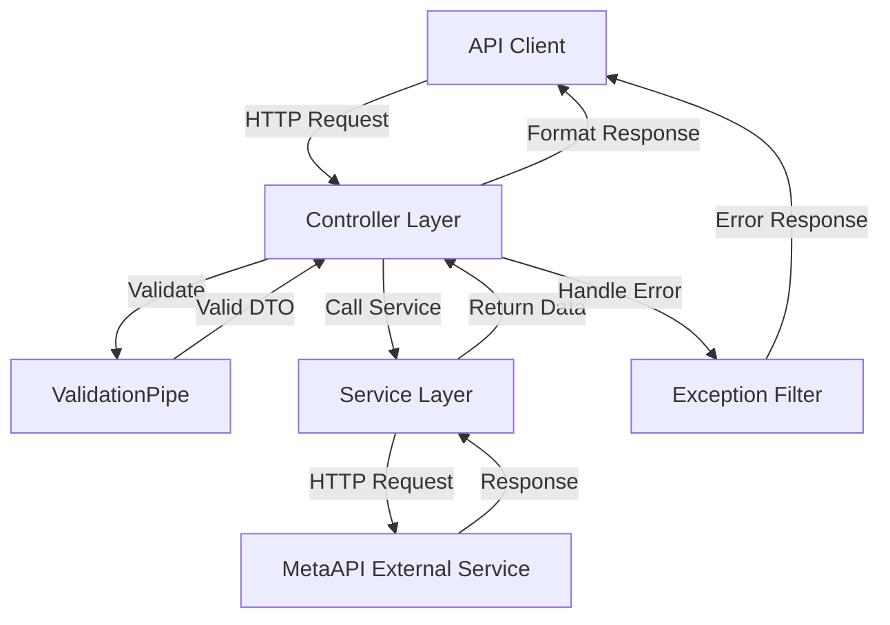

# Technical Design Document: REST API Controllers

## Overview

This feature adds REST API controllers to expose the existing `ProvisioningService` and `TradingService` functionality through HTTP endpoints. The design follows NestJS best practices, RESTful conventions, and provides comprehensive request validation, error handling, and OpenAPI/Swagger documentation.

### Goals

- Expose all ProvisioningService methods through REST endpoints
- Expose all TradingService methods through REST endpoints
- Implement automatic request validation using class-validator
- Provide consistent error handling and response formatting
- Generate OpenAPI/Swagger documentation for all endpoints
- Maintain separation of concerns (controllers handle HTTP, services handle business logic)

### Non-Goals

- Authentication/authorization (will be added in a future feature)
- Rate limiting (will be added in a future feature)
- Response caching (will be added in a future feature)
- WebSocket endpoints (out of scope for this feature)

## Architecture

### High-Level Architecture



### Controller Architecture

The design follows a layered architecture:

1. **Controller Layer**: Handles HTTP concerns (routing, validation, response formatting)
2. **Service Layer**: Contains business logic and external API integration (already implemented)
3. **DTO Layer**: Defines request/response schemas with validation rules
4. **Exception Handling**: Transforms service exceptions into appropriate HTTP responses

### Module Structure

```
src/modules/
├── provisioning/
│   ├── provisioning.controller.ts       (NEW)
│   ├── provisioning.service.ts          (EXISTING)
│   ├── provisioning.module.ts           (EXISTING - will be updated)
│   └── dto/                             (NEW)
│       ├── create-account.dto.ts
│       ├── update-account.dto.ts
│       ├── create-demo-account.dto.ts
│       └── create-live-account.dto.ts
└── trading/
    ├── trading.controller.ts            (NEW)
    ├── trading.service.ts               (EXISTING)
    ├── trading.module.ts                (EXISTING - will be updated)
    └── dto/                             (NEW)
        ├── trade.dto.ts
        ├── margin-query.dto.ts
        ├── time-range-query.dto.ts
        └── candles-query.dto.ts
```

## Components and Interfaces

### 1. Provisioning Controller

**File**: `src/modules/provisioning/provisioning.controller.ts`

**Responsibilities**:
- Handle HTTP requests for account provisioning operations
- Validate request data using DTOs
- Delegate business logic to ProvisioningService
- Format responses and handle errors

**Endpoints**:

| Method | Path | Description | Request Body | Response |
|--------|------|-------------|--------------|----------|
| GET | `/provisioning/accounts` | List all accounts | - | `MetaApiAccount[]` |
| GET | `/provisioning/accounts/:accountId` | Get single account | - | `MetaApiAccount` |
| POST | `/provisioning/accounts` | Create account | `CreateAccountDto` | `MetaApiAccount` |
| PUT | `/provisioning/accounts/:accountId` | Update account | `UpdateAccountDto` | `MetaApiAccount` |
| DELETE | `/provisioning/accounts/:accountId` | Delete account | - | `void` |
| POST | `/provisioning/accounts/:accountId/deploy` | Deploy account | - | `void` |
| POST | `/provisioning/accounts/:accountId/undeploy` | Undeploy account | - | `void` |
| POST | `/provisioning/accounts/:accountId/redeploy` | Redeploy account | - | `void` |
| POST | `/provisioning/profiles/:profileId/demo-accounts` | Create demo account | `CreateDemoAccountDto` | `MetaApiAccount` |
| POST | `/provisioning/live-accounts` | Create live account | `CreateLiveAccountDto` | `MetaApiAccount` |

**Decorators**:
- `@Controller('provisioning')`: Define base route
- `@ApiTags('Provisioning')`: Group endpoints in Swagger
- `@Get()`, `@Post()`, `@Put()`, `@Delete()`: HTTP method decorators
- `@Param()`: Extract path parameters
- `@Body()`: Extract and validate request body
- `@HttpCode()`: Set custom HTTP status codes
- `@ApiOperation()`: Document endpoint purpose
- `@ApiResponse()`: Document response types
- `@ApiParam()`: Document path parameters
- `@ApiBody()`: Document request body

### 2. Trading Controller

**File**: `src/modules/trading/trading.controller.ts`

**Responsibilities**:
- Handle HTTP requests for trading operations
- Validate request data using DTOs
- Delegate business logic to TradingService
- Format responses and handle errors

**Endpoints**:

| Method | Path | Description | Query Params | Response |
|--------|------|-------------|--------------|----------|
| GET | `/trading/accounts/:accountId/information` | Get account info | - | `AccountInformation` |
| GET | `/trading/accounts/:accountId/positions` | List positions | - | `Position[]` |
| GET | `/trading/accounts/:accountId/positions/:positionId` | Get position | - | `Position` |
| GET | `/trading/accounts/:accountId/orders` | List pending orders | - | `PendingOrder[]` |
| GET | `/trading/accounts/:accountId/orders/:orderId` | Get pending order | - | `PendingOrder` |
| GET | `/trading/accounts/:accountId/history-orders/time` | Get history orders by time | `startTime`, `endTime` | `HistoryOrder[]` |
| GET | `/trading/accounts/:accountId/history-orders/ticket/:ticket` | Get history orders by ticket | - | `HistoryOrder[]` |
| GET | `/trading/accounts/:accountId/deals/time` | Get deals by time | `startTime`, `endTime` | `Deal[]` |
| GET | `/trading/accounts/:accountId/deals/ticket/:ticket` | Get deals by ticket | - | `Deal[]` |
| GET | `/trading/accounts/:accountId/symbols` | List symbols | - | `string[]` |
| GET | `/trading/accounts/:accountId/symbols/:symbol/specification` | Get symbol spec | - | `SymbolSpec` |
| GET | `/trading/accounts/:accountId/symbols/:symbol/price` | Get current price | - | `CurrentPrice` |
| GET | `/trading/accounts/:accountId/symbols/:symbol/candles` | Get candles | `timeframe` | `Candle[]` |
| GET | `/trading/accounts/:accountId/symbols/:symbol/ticks` | Get ticks | - | `Tick[]` |
| GET | `/trading/accounts/:accountId/symbols/:symbol/order-book` | Get order book | - | `OrderBook` |
| POST | `/trading/accounts/:accountId/trade` | Execute trade | `TradeDto` | `TradeResult` |
| GET | `/trading/accounts/:accountId/server-time` | Get server time | - | `ServerTime` |
| GET | `/trading/accounts/:accountId/margin` | Calculate margin | `symbol`, `type`, `volume` | `MarginResult` |
| GET | `/trading/accounts/:accountId/cpu-credits` | Get CPU credits | - | `CpuCredits` |

**Decorators**: Same as Provisioning Controller, plus:
- `@Query()`: Extract and validate query parameters

## Data Models

### Provisioning DTOs

#### CreateAccountDto

**File**: `src/modules/provisioning/dto/create-account.dto.ts`

```typescript
import { ApiProperty } from '@nestjs/swagger';
import { IsString, IsNotEmpty, IsOptional, IsNumber } from 'class-validator';

export class CreateAccountDto {
  @ApiProperty({ description: 'Account name', example: 'My Trading Account' })
  @IsString()
  @IsNotEmpty()
  name: string;

  @ApiProperty({ description: 'Account type', example: 'cloud' })
  @IsString()
  @IsNotEmpty()
  type: string;

  @ApiProperty({ description: 'Trading account login', example: '12345678' })
  @IsString()
  @IsNotEmpty()
  login: string;

  @ApiProperty({ description: 'Trading account password' })
  @IsString()
  @IsNotEmpty()
  password: string;

  @ApiProperty({ description: 'Broker server name', example: 'ICMarketsSC-Demo' })
  @IsString()
  @IsNotEmpty()
  server: string;

  @ApiProperty({ description: 'Provisioning profile ID' })
  @IsString()
  @IsNotEmpty()
  provisioningProfileId: string;

  @ApiProperty({ description: 'Magic number for EA identification', required: false })
  @IsOptional()
  @IsNumber()
  magic?: number;

  @ApiProperty({ description: 'Trading platform', example: 'mt4', required: false })
  @IsOptional()
  @IsString()
  platform?: string;
}
```

#### UpdateAccountDto

**File**: `src/modules/provisioning/dto/update-account.dto.ts`

```typescript
import { ApiProperty } from '@nestjs/swagger';
import { IsString, IsOptional, IsNumber } from 'class-validator';

export class UpdateAccountDto {
  @ApiProperty({ description: 'Account name', required: false })
  @IsOptional()
  @IsString()
  name?: string;

  @ApiProperty({ description: 'Trading account password', required: false })
  @IsOptional()
  @IsString()
  password?: string;

  @ApiProperty({ description: 'Broker server name', required: false })
  @IsOptional()
  @IsString()
  server?: string;

  @ApiProperty({ description: 'Magic number for EA identification', required: false })
  @IsOptional()
  @IsNumber()
  magic?: number;
}
```

#### CreateDemoAccountDto

**File**: `src/modules/provisioning/dto/create-demo-account.dto.ts`

```typescript
import { ApiProperty } from '@nestjs/swagger';
import { IsString, IsNotEmpty, IsNumber } from 'class-validator';

export class CreateDemoAccountDto {
  @ApiProperty({ description: 'Demo account name', example: 'My Demo Account' })
  @IsString()
  @IsNotEmpty()
  name: string;

  @ApiProperty({ description: 'Initial balance', example: 10000 })
  @IsNumber()
  balance: number;

  @ApiProperty({ description: 'Account leverage', example: 100 })
  @IsNumber()
  leverage: number;

  @ApiProperty({ description: 'Broker server name', example: 'ICMarketsSC-Demo' })
  @IsString()
  @IsNotEmpty()
  serverName: string;
}
```

#### CreateLiveAccountDto

**File**: `src/modules/provisioning/dto/create-live-account.dto.ts`

```typescript
import { ApiProperty } from '@nestjs/swagger';
import { IsString, IsNotEmpty, IsOptional } from 'class-validator';

export class CreateLiveAccountDto {
  @ApiProperty({ description: 'Account name', example: 'My Live Account' })
  @IsString()
  @IsNotEmpty()
  name: string;

  @ApiProperty({ description: 'Trading account login', example: '12345678' })
  @IsString()
  @IsNotEmpty()
  login: string;

  @ApiProperty({ description: 'Trading account password' })
  @IsString()
  @IsNotEmpty()
  password: string;

  @ApiProperty({ description: 'Broker server name', example: 'ICMarketsSC-Live' })
  @IsString()
  @IsNotEmpty()
  server: string;

  @ApiProperty({ description: 'Provisioning profile ID' })
  @IsString()
  @IsNotEmpty()
  provisioningProfileId: string;

  @ApiProperty({ description: 'Trading platform', example: 'mt4', required: false })
  @IsOptional()
  @IsString()
  platform?: string;
}
```

### Trading DTOs

#### TradeDto

**File**: `src/modules/trading/dto/trade.dto.ts`

```typescript
import { ApiProperty } from '@nestjs/swagger';
import { IsString, IsNotEmpty, IsOptional, IsNumber } from 'class-validator';

export class TradeDto {
  @ApiProperty({
    description: 'Trade action type',
    enum: [
      'ORDER_TYPE_BUY',
      'ORDER_TYPE_SELL',
      'ORDER_TYPE_BUY_LIMIT',
      'ORDER_TYPE_SELL_LIMIT',
      'ORDER_TYPE_BUY_STOP',
      'ORDER_TYPE_SELL_STOP',
      'POSITION_MODIFY',
      'POSITION_CLOSE_ID',
      'POSITION_CLOSE_SYMBOL',
      'ORDER_MODIFY',
      'ORDER_CANCEL',
    ],
    example: 'ORDER_TYPE_BUY',
  })
  @IsString()
  @IsNotEmpty()
  actionType: string;

  @ApiProperty({ description: 'Trading symbol', example: 'EURUSD', required: false })
  @IsOptional()
  @IsString()
  symbol?: string;

  @ApiProperty({ description: 'Trade volume in lots', example: 0.01, required: false })
  @IsOptional()
  @IsNumber()
  volume?: number;

  @ApiProperty({ description: 'Open price for pending orders', required: false })
  @IsOptional()
  @IsNumber()
  openPrice?: number;

  @ApiProperty({ description: 'Stop loss price', required: false })
  @IsOptional()
  @IsNumber()
  stopLoss?: number;

  @ApiProperty({ description: 'Take profit price', required: false })
  @IsOptional()
  @IsNumber()
  takeProfit?: number;

  @ApiProperty({ description: 'Position ID for position operations', required: false })
  @IsOptional()
  @IsString()
  positionId?: string;

  @ApiProperty({ description: 'Order ID for order operations', required: false })
  @IsOptional()
  @IsString()
  orderId?: string;

  @ApiProperty({ description: 'Trade comment', required: false })
  @IsOptional()
  @IsString()
  comment?: string;
}
```

#### TimeRangeQueryDto

**File**: `src/modules/trading/dto/time-range-query.dto.ts`

```typescript
import { ApiProperty } from '@nestjs/swagger';
import { IsDateString, IsNotEmpty } from 'class-validator';

export class TimeRangeQueryDto {
  @ApiProperty({
    description: 'Start time in ISO 8601 format',
    example: '2024-01-01T00:00:00.000Z',
  })
  @IsDateString()
  @IsNotEmpty()
  startTime: string;

  @ApiProperty({
    description: 'End time in ISO 8601 format',
    example: '2024-01-31T23:59:59.999Z',
  })
  @IsDateString()
  @IsNotEmpty()
  endTime: string;
}
```

#### CandlesQueryDto

**File**: `src/modules/trading/dto/candles-query.dto.ts`

```typescript
import { ApiProperty } from '@nestjs/swagger';
import { IsString, IsNotEmpty } from 'class-validator';

export class CandlesQueryDto {
  @ApiProperty({
    description: 'Candle timeframe',
    example: '1h',
    enum: ['1m', '5m', '15m', '30m', '1h', '4h', '1d', '1w', '1M'],
  })
  @IsString()
  @IsNotEmpty()
  timeframe: string;
}
```

#### MarginQueryDto

**File**: `src/modules/trading/dto/margin-query.dto.ts`

```typescript
import { ApiProperty } from '@nestjs/swagger';
import { IsString, IsNotEmpty, IsNumber } from 'class-validator';

export class MarginQueryDto {
  @ApiProperty({ description: 'Trading symbol', example: 'EURUSD' })
  @IsString()
  @IsNotEmpty()
  symbol: string;

  @ApiProperty({ description: 'Order type', example: 'ORDER_TYPE_BUY' })
  @IsString()
  @IsNotEmpty()
  type: string;

  @ApiProperty({ description: 'Trade volume in lots', example: 0.01 })
  @IsNumber()
  volume: number;
}
```

### Response Types

All response types are already defined in the existing interfaces:
- `src/integrations/metaapi/interfaces/provisioning.interfaces.ts`
- `src/integrations/metaapi/interfaces/trading.interfaces.ts`

These interfaces will be reused for response documentation in Swagger decorators.

## Error Handling

### Error Handling Strategy

NestJS provides built-in exception handling through exception filters. The existing services use `handleHttpError()` which throws NestJS exceptions. The controllers will rely on NestJS's global exception filter to transform these into HTTP responses.

### Exception Types and HTTP Status Codes

| Exception Type | HTTP Status | Use Case |
|----------------|-------------|----------|
| `BadRequestException` | 400 | Invalid request data, validation failures |
| `NotFoundException` | 404 | Resource not found (account, position, order) |
| `UnauthorizedException` | 401 | Authentication failure (future) |
| `ForbiddenException` | 403 | Authorization failure (future) |
| `InternalServerErrorException` | 500 | Unexpected errors |

### Error Response Format

NestJS automatically formats error responses as:

```typescript
{
  "statusCode": number,
  "message": string | string[],
  "error": string
}
```

For validation errors, the `message` field contains an array of validation error messages.

### Validation Error Example

```json
{
  "statusCode": 400,
  "message": [
    "name should not be empty",
    "balance must be a number"
  ],
  "error": "Bad Request"
}
```

### Service Error Propagation

The existing services already throw appropriate exceptions via `handleHttpError()`. Controllers will not catch these exceptions, allowing them to propagate to NestJS's global exception filter.

## Testing Strategy

### Unit Testing Approach

**Controller Unit Tests**:
- Mock the service layer
- Test request validation (valid and invalid inputs)
- Test response formatting
- Test error handling
- Verify correct service methods are called with correct parameters

**Test Structure**:
```typescript
describe('ProvisioningController', () => {
  let controller: ProvisioningController;
  let service: ProvisioningService;

  beforeEach(async () => {
    const module = await Test.createTestingModule({
      controllers: [ProvisioningController],
      providers: [
        {
          provide: ProvisioningService,
          useValue: {
            listAccounts: jest.fn(),
            getAccount: jest.fn(),
            // ... other mocked methods
          },
        },
      ],
    }).compile();

    controller = module.get<ProvisioningController>(ProvisioningController);
    service = module.get<ProvisioningService>(ProvisioningService);
  });

  describe('listAccounts', () => {
    it('should return an array of accounts', async () => {
      const result = [{ _id: '1', name: 'Test Account', /* ... */ }];
      jest.spyOn(service, 'listAccounts').mockResolvedValue(result);
      expect(await controller.listAccounts()).toBe(result);
    });
  });

  describe('createAccount', () => {
    it('should create and return an account', async () => {
      const dto = { name: 'Test', type: 'cloud', /* ... */ };
      const result = { _id: '1', ...dto };
      jest.spyOn(service, 'createAccount').mockResolvedValue(result);
      expect(await controller.createAccount(dto)).toBe(result);
    });
  });

  // ... more tests
});
```

### Integration Testing Approach

**E2E Tests**:
- Test full HTTP request/response cycle
- Use real NestJS application instance
- Mock external MetaAPI calls
- Test validation pipeline
- Test error responses

**Test Structure**:
```typescript
describe('Provisioning API (e2e)', () => {
  let app: INestApplication;

  beforeAll(async () => {
    const moduleFixture = await Test.createTestingModule({
      imports: [AppModule],
    }).compile();

    app = moduleFixture.createNestApplication();
    app.useGlobalPipes(new ValidationPipe());
    await app.init();
  });

  it('/provisioning/accounts (GET)', () => {
    return request(app.getHttpServer())
      .get('/provisioning/accounts')
      .expect(200)
      .expect((res) => {
        expect(Array.isArray(res.body)).toBe(true);
      });
  });

  it('/provisioning/accounts (POST) - validation error', () => {
    return request(app.getHttpServer())
      .post('/provisioning/accounts')
      .send({ name: '' }) // Invalid: missing required fields
      .expect(400)
      .expect((res) => {
        expect(res.body.message).toBeInstanceOf(Array);
      });
  });

  // ... more tests
});
```

### Test Coverage Goals

- **Unit Tests**: 100% coverage of controller methods
- **Integration Tests**: Cover all endpoints with valid and invalid requests
- **Validation Tests**: Test all DTO validation rules
- **Error Handling Tests**: Test all error scenarios

### Testing Tools

- **Jest**: Test runner and assertion library (already configured)
- **Supertest**: HTTP assertion library for E2E tests
- **@nestjs/testing**: NestJS testing utilities

## Implementation Plan

### Phase 1: Setup and Infrastructure

1. Install required dependencies:
   ```bash
   npm install @nestjs/swagger class-validator class-transformer
   ```

2. Configure global validation pipe in `main.ts`:
   ```typescript
   import { ValidationPipe } from '@nestjs/common';
   import { NestFactory } from '@nestjs/core';
   import { DocumentBuilder, SwaggerModule } from '@nestjs/swagger';
   import { AppModule } from './app.module';

   async function bootstrap() {
     const app = await NestFactory.create(AppModule);
     
     // Enable validation
     app.useGlobalPipes(new ValidationPipe({
       whitelist: true,
       forbidNonWhitelisted: true,
       transform: true,
     }));

     // Setup Swagger
     const config = new DocumentBuilder()
       .setTitle('MetaAPI Trading Platform')
       .setDescription('REST API for MetaAPI account provisioning and trading operations')
       .setVersion('1.0')
       .build();
     const document = SwaggerModule.createDocument(app, config);
     SwaggerModule.setup('api', app, document);

     await app.listen(process.env.PORT ?? 3000);
   }
   bootstrap();
   ```

### Phase 2: Provisioning Module

1. Create DTOs in `src/modules/provisioning/dto/`
2. Create `provisioning.controller.ts`
3. Update `provisioning.module.ts` to include controller
4. Write unit tests for controller
5. Write E2E tests for provisioning endpoints

### Phase 3: Trading Module

1. Create DTOs in `src/modules/trading/dto/`
2. Create `trading.controller.ts`
3. Update `trading.module.ts` to include controller
4. Write unit tests for controller
5. Write E2E tests for trading endpoints

### Phase 4: Documentation and Testing

1. Verify Swagger documentation is complete
2. Run full test suite
3. Manual testing of all endpoints
4. Update README with API documentation link

## Dependencies

### New Dependencies

```json
{
  "@nestjs/swagger": "^8.0.0",
  "class-validator": "^0.14.0",
  "class-transformer": "^0.5.1"
}
```

### Existing Dependencies (No Changes)

- `@nestjs/common`
- `@nestjs/core`
- `@nestjs/axios`
- All other existing dependencies

## Configuration

### Environment Variables

No new environment variables required. The controllers will use the existing configuration from `MetaApiConfigService`.

### Validation Configuration

The `ValidationPipe` will be configured globally with:
- `whitelist: true` - Strip properties not defined in DTOs
- `forbidNonWhitelisted: true` - Throw error if unknown properties are present
- `transform: true` - Automatically transform payloads to DTO instances

## Swagger Documentation Configuration

### Swagger Setup

The Swagger UI will be available at `/api` endpoint and will include:
- All endpoint documentation
- Request/response schemas
- Example values
- Validation rules
- Error responses

### Swagger Decorators Usage

Each controller will use:
- `@ApiTags()` - Group endpoints by module
- `@ApiOperation()` - Describe endpoint purpose
- `@ApiResponse()` - Document success and error responses
- `@ApiParam()` - Document path parameters
- `@ApiQuery()` - Document query parameters
- `@ApiBody()` - Document request body

Example:
```typescript
@ApiTags('Provisioning')
@Controller('provisioning')
export class ProvisioningController {
  @Get('accounts')
  @ApiOperation({ summary: 'List all MetaAPI accounts' })
  @ApiResponse({ status: 200, description: 'List of accounts', type: [MetaApiAccount] })
  @ApiResponse({ status: 500, description: 'Internal server error' })
  async listAccounts(): Promise<MetaApiAccount[]> {
    return this.provisioningService.listAccounts();
  }
}
```

## Security Considerations

### Current State

- No authentication/authorization implemented in this feature
- API tokens are managed by `MetaApiConfigService` and used by services
- Controllers do not handle authentication

### Future Enhancements

- Add authentication middleware (JWT, API keys)
- Add authorization guards for role-based access control
- Add rate limiting to prevent abuse
- Add request logging for audit trails

## Performance Considerations

### Response Time

- Controllers add minimal overhead (routing, validation)
- Most latency comes from MetaAPI external calls (handled by services)
- No caching implemented in this feature

### Validation Performance

- `class-validator` validation is synchronous and fast
- Validation happens before service calls, failing fast on invalid input

### Scalability

- Controllers are stateless and horizontally scalable
- No in-memory state or caching
- Database connections managed by existing infrastructure

## Monitoring and Observability

### Logging

- Controllers will use NestJS Logger for request/error logging
- Service layer already has logging via `Logger`
- Log levels: error, warn, log, debug

### Metrics (Future)

- Request count per endpoint
- Response time per endpoint
- Error rate per endpoint
- Validation failure rate

## Deployment Considerations

### Build Process

No changes to existing build process:
```bash
npm run build
npm run start:prod
```

### Environment Setup

No new environment variables required.

### Health Checks (Future)

Consider adding health check endpoints:
- `/health` - Basic health check
- `/health/ready` - Readiness probe (check database, external services)

## Appendix

### NestJS Controller Best Practices

1. **Keep controllers thin** - Delegate business logic to services
2. **Use DTOs for validation** - Never trust raw request data
3. **Use proper HTTP status codes** - 200, 201, 204, 400, 404, 500
4. **Document with Swagger** - Make API self-documenting
5. **Handle errors gracefully** - Let exception filters handle errors
6. **Use dependency injection** - Inject services via constructor
7. **Follow RESTful conventions** - Use appropriate HTTP methods and resource naming

### HTTP Status Code Guidelines

- **200 OK**: Successful GET, PUT, PATCH requests
- **201 Created**: Successful POST requests that create resources
- **204 No Content**: Successful DELETE requests
- **400 Bad Request**: Validation errors, malformed requests
- **404 Not Found**: Resource not found
- **500 Internal Server Error**: Unexpected server errors

### RESTful Naming Conventions

- Use plural nouns for collections: `/accounts`, `/positions`
- Use singular nouns for single resources: `/accounts/:id`
- Use nested routes for related resources: `/accounts/:id/positions`
- Use verbs for actions: `/accounts/:id/deploy`
- Use kebab-case for multi-word resources: `/demo-accounts`

### Validation Best Practices

1. **Validate at the boundary** - Use DTOs with class-validator
2. **Fail fast** - Validate before calling services
3. **Provide clear error messages** - Use descriptive validation decorators
4. **Whitelist properties** - Strip unknown properties
5. **Transform types** - Convert strings to numbers, dates, etc.

### Example Request/Response Flows

#### Create Account Flow

```
1. Client sends POST /provisioning/accounts
   Body: { name: "Test", type: "cloud", login: "123", ... }

2. ValidationPipe validates CreateAccountDto
   - Checks all required fields present
   - Validates field types
   - Transforms to DTO instance

3. Controller receives validated DTO
   - Calls provisioningService.createAccount(dto)

4. Service makes HTTP call to MetaAPI
   - Returns MetaApiAccount or throws exception

5. Controller returns response
   - Success: 201 Created with account data
   - Error: Appropriate status code with error message
```

#### Get Positions Flow

```
1. Client sends GET /trading/accounts/abc123/positions

2. Controller extracts accountId from path
   - Calls tradingService.getPositions(accountId)

3. Service makes HTTP call to MetaAPI
   - Returns Position[] or throws exception

4. Controller returns response
   - Success: 200 OK with positions array
   - Error: Appropriate status code with error message
```
