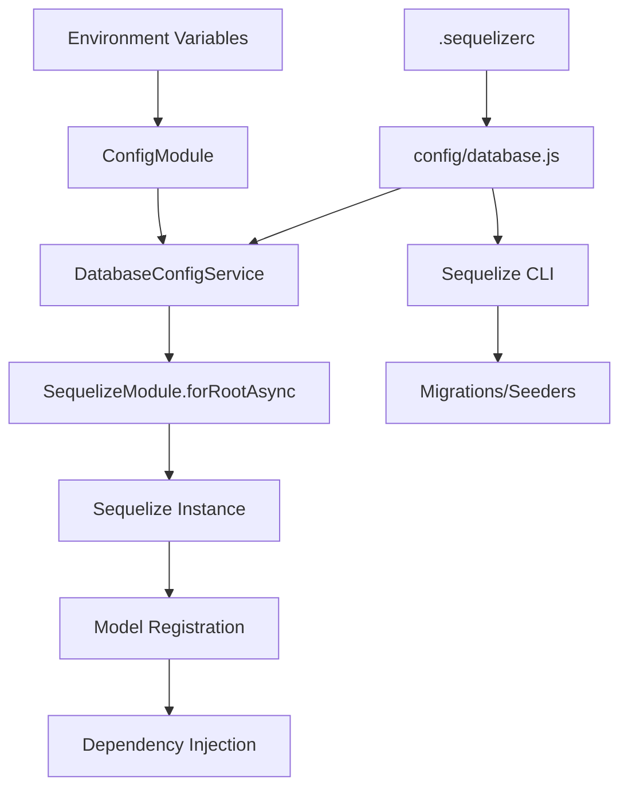

# Design Document: Sequelize ORM Setup

## Overview

This design document specifies the technical implementation for integrating Sequelize ORM and Sequelize CLI into an existing NestJS application. The integration provides type-safe database operations, migration management, and seeding capabilities while adhering to NestJS architectural patterns.

### Key Design Principles

1. **Single Source of Truth**: Database models serve as the authoritative definition of database schema, with migrations generated to reflect model changes
2. **Type Safety**: Leverage TypeScript and sequelize-typescript decorators for compile-time type checking
3. **Environment Isolation**: Support distinct configurations for development, testing, and production environments
4. **Query Optimization**: Implement connection pooling, prepared statements, and indexing strategies for optimal performance
5. **NestJS Integration**: Follow NestJS dependency injection patterns and module structure

### Technology Stack

- **ORM**: Sequelize v6+ with sequelize-typescript for decorator support
- **CLI**: Sequelize CLI for migration and seeder management
- **Framework**: NestJS with @nestjs/sequelize integration package
- **Database Support**: PostgreSQL (primary), MySQL, SQLite (development), MSSQL

## Architecture

### Module Structure

```
src/
├── config/
│   ├── database.config.ts          # Database configuration service
│   └── database.js                 # Sequelize CLI configuration
├── database/
│   ├── models/                     # Sequelize model definitions
│   │   ├── index.ts               # Model barrel export
│   │   ├── user.model.ts          # Example: User model
│   │   └── base.model.ts          # Base model with common fields
│   ├── migrations/                 # Migration files (timestamped)
│   ├── seeders/                    # Seeder files (timestamped)
│   └── database.module.ts          # Database module configuration
└── app.module.ts                   # Root module with database import
```

### Configuration Flow



### Dependency Injection Pattern

The design follows NestJS's dependency injection pattern:

1. **DatabaseModule**: Configures and exports SequelizeModule
2. **Model Registration**: Models registered via `SequelizeModule.forFeature()`
3. **Service Injection**: Models injected into services using `@InjectModel()`
4. **Repository Pattern**: Optional repository layer for complex queries

## Components and Interfaces

### 1. Database Configuration Service

**Purpose**: Centralize database configuration and environment-specific settings

**Interface**:
```typescript
interface DatabaseConfig {
  dialect: 'postgres' | 'mysql' | 'sqlite' | 'mssql';
  host: string;
  port: number;
  username: string;
  password: string;
  database: string;
  logging: boolean | ((sql: string, timing?: number) => void);
  pool: PoolOptions;
  dialectOptions?: DialectOptions;
  autoLoadModels: boolean;
  synchronize: boolean;
}

interface PoolOptions {
  max: number;
  min: number;
  acquire: number;
  idle: number;
  evict: number;
}
```

**Implementation Strategy**:
- Use `@nestjs/config` for environment variable management
- Provide validation for required configuration values
- Support multiple database dialects through configuration
- Enable SSL for production PostgreSQL connections

### 2. Base Model

**Purpose**: Provide common fields and functionality for all models

**Interface**:
```typescript
abstract class BaseModel extends Model {
  @PrimaryKey
  @Default(DataType.UUIDV4)
  @Column(DataType.UUID)
  id: string;

  @CreatedAt
  @Column(DataType.DATE)
  createdAt: Date;

  @UpdatedAt
  @Column(DataType.DATE)
  updatedAt: Date;

  @DeletedAt
  @Column(DataType.DATE)
  deletedAt?: Date;
}
```

**Features**:
- UUID primary keys by default
- Automatic timestamp management
- Soft delete support via `deletedAt`
- Extensible for custom base functionality

### 3. Model Definition Pattern

**Purpose**: Define database tables using TypeScript decorators

**Example**:
```typescript
@Table({
  tableName: 'users',
  timestamps: true,
  paranoid: true,
  indexes: [
    { fields: ['email'], unique: true },
    { fields: ['createdAt'] }
  ]
})
export class User extends BaseModel {
  @Column({
    type: DataType.STRING(255),
    allowNull: false,
    validate: {
      notEmpty: true,
      isEmail: true
    }
  })
  email: string;

  @Column({
    type: DataType.STRING(255),
    allowNull: false
  })
  password: string;

  @Column({
    type: DataType.STRING(100),
    allowNull: true
  })
  firstName?: string;

  @Column({
    type: DataType.STRING(100),
    allowNull: true
  })
  lastName?: string;

  @HasMany(() => Post)
  posts: Post[];
}
```

**Type Safety Features**:
- Generic type parameters: `Model<User, UserCreationAttributes>`
- Creation attributes interface for `create()` operations
- Update attributes interface for `update()` operations
- Automatic type inference for query results

### 4. Migration File Structure

**Purpose**: Version control database schema changes

**Template**:
```typescript
import { QueryInterface, DataTypes } from 'sequelize';

export default {
  async up(queryInterface: QueryInterface): Promise<void> {
    await queryInterface.createTable('users', {
      id: {
        type: DataTypes.UUID,
        defaultValue: DataTypes.UUIDV4,
        primaryKey: true
      },
      email: {
        type: DataTypes.STRING(255),
        allowNull: false,
        unique: true
      },
      password: {
        type: DataTypes.STRING(255),
        allowNull: false
      },
      firstName: {
        type: DataTypes.STRING(100),
        allowNull: true
      },
      lastName: {
        type: DataTypes.STRING(100),
        allowNull: true
      },
      createdAt: {
        type: DataTypes.DATE,
        allowNull: false
      },
      updatedAt: {
        type: DataTypes.DATE,
        allowNull: false
      },
      deletedAt: {
        type: DataTypes.DATE,
        allowNull: true
      }
    });

    await queryInterface.addIndex('users', ['email'], {
      unique: true,
      name: 'users_email_unique'
    });

    await queryInterface.addIndex('users', ['createdAt'], {
      name: 'users_created_at_idx'
    });
  },

  async down(queryInterface: QueryInterface): Promise<void> {
    await queryInterface.dropTable('users');
  }
};
```

**Migration Workflow**:
1. Developer modifies model definition
2. Developer generates migration: `npm run migration:generate -- --name add-user-table`
3. Developer implements `up` and `down` functions based on model changes
4. Migration is committed to version control
5. Migration is applied in target environment: `npm run migrate`

### 5. Seeder File Structure

**Purpose**: Populate database with initial or test data

**Template**:
```typescript
import { QueryInterface } from 'sequelize';

export default {
  async up(queryInterface: QueryInterface): Promise<void> {
    await queryInterface.bulkInsert('users', [
      {
        id: '550e8400-e29b-41d4-a716-446655440000',
        email: 'admin@example.com',
        password: '$2b$10$...',  // hashed password
        firstName: 'Admin',
        lastName: 'User',
        createdAt: new Date(),
        updatedAt: new Date()
      },
      {
        id: '550e8400-e29b-41d4-a716-446655440001',
        email: 'user@example.com',
        password: '$2b$10$...',
        firstName: 'Regular',
        lastName: 'User',
        createdAt: new Date(),
        updatedAt: new Date()
      }
    ]);
  },

  async down(queryInterface: QueryInterface): Promise<void> {
    await queryInterface.bulkDelete('users', {
      email: ['admin@example.com', 'user@example.com']
    });
  }
};
```

### 6. CLI Configuration

**Purpose**: Configure Sequelize CLI paths and database connection

**.sequelizerc**:
```javascript
const path = require('path');

module.exports = {
  'config': path.resolve('dist', 'config', 'database.js'),
  'models-path': path.resolve('dist', 'database', 'models'),
  'seeders-path': path.resolve('database', 'seeders'),
  'migrations-path': path.resolve('database', 'migrations')
};
```

**config/database.js**:
```javascript
require('dotenv').config();

module.exports = {
  development: {
    dialect: 'sqlite',
    storage: './dev.sqlite3',
    logging: console.log
  },
  test: {
    dialect: 'sqlite',
    storage: ':memory:',
    logging: false
  },
  production: {
    dialect: process.env.DB_DIALECT || 'postgres',
    host: process.env.DB_HOST,
    port: parseInt(process.env.DB_PORT, 10) || 5432,
    username: process.env.DB_USERNAME,
    password: process.env.DB_PASSWORD,
    database: process.env.DB_DATABASE,
    logging: false,
    pool: {
      max: 20,
      min: 5,
      acquire: 30000,
      idle: 10000,
      evict: 10000
    },
    dialectOptions: {
      ssl: {
        require: true,
        rejectUnauthorized: false
      }
    }
  }
};
```

## Data Models

### Model Relationships

The design supports all Sequelize relationship types:

1. **One-to-Many**: `@HasMany` and `@BelongsTo`
2. **Many-to-Many**: `@BelongsToMany` with junction table
3. **One-to-One**: `@HasOne` and `@BelongsTo`

**Example Relationships**:
```typescript
// User has many Posts
@Table({ tableName: 'users' })
export class User extends BaseModel {
  @HasMany(() => Post)
  posts: Post[];
}

// Post belongs to User
@Table({ tableName: 'posts' })
export class Post extends BaseModel {
  @ForeignKey(() => User)
  @Column(DataType.UUID)
  userId: string;

  @BelongsTo(() => User)
  user: User;
}

// Many-to-Many: Users and Roles
@Table({ tableName: 'users' })
export class User extends BaseModel {
  @BelongsToMany(() => Role, () => UserRole)
  roles: Role[];
}

@Table({ tableName: 'roles' })
export class Role extends BaseModel {
  @BelongsToMany(() => User, () => UserRole)
  users: User[];
}

@Table({ tableName: 'user_roles' })
export class UserRole extends Model {
  @ForeignKey(() => User)
  @Column(DataType.UUID)
  userId: string;

  @ForeignKey(() => Role)
  @Column(DataType.UUID)
  roleId: string;
}
```

### Type-Safe Attributes

**Creation Attributes**:
```typescript
interface UserCreationAttributes {
  email: string;
  password: string;
  firstName?: string;
  lastName?: string;
}

// Usage with type safety
const user = await User.create({
  email: 'test@example.com',
  password: 'hashed_password',
  firstName: 'John'
});
```

**Update Attributes**:
```typescript
interface UserUpdateAttributes {
  email?: string;
  password?: string;
  firstName?: string;
  lastName?: string;
}

// Usage with type safety
await user.update({
  firstName: 'Jane'
});
```

### Index Strategy

Indexes are defined in model decorators and reflected in migrations:

1. **Unique Indexes**: Email, username, external IDs
2. **Query Indexes**: Frequently filtered columns (status, createdAt)
3. **Foreign Key Indexes**: Automatically created for relationships
4. **Composite Indexes**: Multi-column queries

**Example**:
```typescript
@Table({
  tableName: 'posts',
  indexes: [
    { fields: ['userId'] },                    // Foreign key index
    { fields: ['status'] },                    // Query filter index
    { fields: ['createdAt'] },                 // Sorting index
    { fields: ['userId', 'status'] },          // Composite index
    { fields: ['slug'], unique: true }         // Unique constraint
  ]
})
export class Post extends BaseModel {
  // ... model definition
}
```

## Error Handling

### Error Types and Handling Strategy

**1. Connection Errors**:
```typescript
try {
  await sequelize.authenticate();
} catch (error) {
  if (error instanceof ConnectionError) {
    logger.error('Database connection failed', {
      host: config.host,
      port: config.port,
      database: config.database,
      error: error.message
    });
    throw new ServiceUnavailableException('Database connection failed');
  }
}
```

**2. Query Errors**:
```typescript
try {
  const user = await User.findOne({ where: { email } });
} catch (error) {
  if (error instanceof DatabaseError) {
    logger.error('Query execution failed', {
      query: error.sql,
      error: error.message
    });
    throw new InternalServerErrorException('Database query failed');
  }
}
```

**3. Constraint Violations**:
```typescript
try {
  await User.create({ email, password });
} catch (error) {
  if (error instanceof UniqueConstraintError) {
    const field = error.errors[0]?.path;
    throw new ConflictException(`${field} already exists`);
  }
  if (error instanceof ForeignKeyConstraintError) {
    throw new BadRequestException('Referenced record does not exist');
  }
}
```

**4. Validation Errors**:
```typescript
try {
  await user.update({ email: 'invalid-email' });
} catch (error) {
  if (error instanceof ValidationError) {
    const messages = error.errors.map(e => e.message);
    throw new BadRequestException(messages);
  }
}
```

### Logging Integration

**Development Mode**:
```typescript
logging: (sql: string, timing?: number) => {
  logger.debug(`[Sequelize] ${sql}`, { timing });
}
```

**Production Mode**:
```typescript
logging: false  // Disable query logging for performance
```

**Migration Errors**:
- Sequelize CLI logs errors to console
- Failed migrations are not recorded in SequelizeMeta
- Transaction rollback ensures database consistency

## Testing Strategy

### Testing Approach

Since this feature involves infrastructure setup, configuration, and ORM integration rather than pure business logic with universal properties, **property-based testing is not applicable**. The testing strategy focuses on:

1. **Unit Tests**: Test individual components and services
2. **Integration Tests**: Test database operations and migrations
3. **Configuration Tests**: Validate environment-specific settings
4. **Migration Tests**: Verify migration up/down operations

### Unit Testing

**Test Coverage**:
- Database configuration service validation
- Model definition and decorator usage
- Type safety verification
- Error handling logic

**Example Test**:
```typescript
describe('DatabaseConfigService', () => {
  it('should validate required environment variables', () => {
    const config = new DatabaseConfigService();
    expect(() => config.getProductionConfig()).toThrow(
      'DB_HOST is required for production'
    );
  });

  it('should provide default development configuration', () => {
    const config = new DatabaseConfigService();
    const devConfig = config.getDevelopmentConfig();
    expect(devConfig.dialect).toBe('sqlite');
    expect(devConfig.storage).toBe('./dev.sqlite3');
  });

  it('should configure connection pool for production', () => {
    process.env.DB_HOST = 'localhost';
    process.env.DB_USERNAME = 'user';
    process.env.DB_PASSWORD = 'pass';
    process.env.DB_DATABASE = 'db';
    
    const config = new DatabaseConfigService();
    const prodConfig = config.getProductionConfig();
    
    expect(prodConfig.pool.max).toBe(20);
    expect(prodConfig.pool.min).toBe(5);
  });
});
```

### Integration Testing

**Test Coverage**:
- Database connection establishment
- Model CRUD operations
- Relationship queries (eager loading, lazy loading)
- Transaction handling
- Constraint enforcement

**Example Test**:
```typescript
describe('User Model Integration', () => {
  let sequelize: Sequelize;

  beforeAll(async () => {
    sequelize = new Sequelize({
      dialect: 'sqlite',
      storage: ':memory:',
      logging: false
    });
    sequelize.addModels([User, Post]);
    await sequelize.sync({ force: true });
  });

  afterAll(async () => {
    await sequelize.close();
  });

  it('should create a user with valid data', async () => {
    const user = await User.create({
      email: 'test@example.com',
      password: 'hashed_password'
    });
    
    expect(user.id).toBeDefined();
    expect(user.email).toBe('test@example.com');
    expect(user.createdAt).toBeInstanceOf(Date);
  });

  it('should enforce unique email constraint', async () => {
    await User.create({
      email: 'duplicate@example.com',
      password: 'pass1'
    });
    
    await expect(
      User.create({
        email: 'duplicate@example.com',
        password: 'pass2'
      })
    ).rejects.toThrow(UniqueConstraintError);
  });

  it('should eager load related posts', async () => {
    const user = await User.create({
      email: 'author@example.com',
      password: 'pass'
    });
    
    await Post.create({
      title: 'Test Post',
      content: 'Content',
      userId: user.id
    });
    
    const userWithPosts = await User.findByPk(user.id, {
      include: [Post]
    });
    
    expect(userWithPosts.posts).toHaveLength(1);
    expect(userWithPosts.posts[0].title).toBe('Test Post');
  });
});
```

### Migration Testing

**Test Coverage**:
- Migration up/down operations
- Schema changes reflected correctly
- Data integrity during migrations
- Rollback functionality

**Example Test**:
```typescript
describe('User Migration', () => {
  let queryInterface: QueryInterface;

  beforeEach(async () => {
    const sequelize = new Sequelize({
      dialect: 'sqlite',
      storage: ':memory:',
      logging: false
    });
    queryInterface = sequelize.getQueryInterface();
  });

  it('should create users table with correct schema', async () => {
    const migration = require('./20240101000000-create-users-table');
    await migration.up(queryInterface);
    
    const tables = await queryInterface.showAllTables();
    expect(tables).toContain('users');
    
    const columns = await queryInterface.describeTable('users');
    expect(columns.id).toBeDefined();
    expect(columns.email).toBeDefined();
    expect(columns.email.allowNull).toBe(false);
  });

  it('should rollback table creation', async () => {
    const migration = require('./20240101000000-create-users-table');
    await migration.up(queryInterface);
    await migration.down(queryInterface);
    
    const tables = await queryInterface.showAllTables();
    expect(tables).not.toContain('users');
  });
});
```

### Configuration Testing

**Test Coverage**:
- Environment variable parsing
- SSL configuration for production
- Connection pool settings
- Dialect-specific options

**Example Test**:
```typescript
describe('Database Configuration', () => {
  it('should enable SSL for production PostgreSQL', () => {
    process.env.NODE_ENV = 'production';
    process.env.DB_DIALECT = 'postgres';
    process.env.DB_HOST = 'prod-db.example.com';
    
    const config = getDatabaseConfig();
    
    expect(config.dialectOptions.ssl).toBeDefined();
    expect(config.dialectOptions.ssl.require).toBe(true);
  });

  it('should use in-memory SQLite for tests', () => {
    process.env.NODE_ENV = 'test';
    
    const config = getDatabaseConfig();
    
    expect(config.dialect).toBe('sqlite');
    expect(config.storage).toBe(':memory:');
    expect(config.logging).toBe(false);
  });
});
```

### Test Execution

**NPM Scripts**:
```json
{
  "scripts": {
    "test": "jest",
    "test:watch": "jest --watch",
    "test:cov": "jest --coverage",
    "test:integration": "jest --testPathPattern=integration",
    "test:unit": "jest --testPathPattern=unit"
  }
}
```

**Jest Configuration**:
```javascript
module.exports = {
  moduleFileExtensions: ['js', 'json', 'ts'],
  rootDir: 'src',
  testRegex: '.*\\.spec\\.ts$',
  transform: {
    '^.+\\.(t|j)s$': 'ts-jest'
  },
  collectCoverageFrom: [
    '**/*.(t|j)s',
    '!**/*.spec.ts',
    '!**/node_modules/**'
  ],
  coverageDirectory: '../coverage',
  testEnvironment: 'node',
  setupFilesAfterEnv: ['<rootDir>/test/setup.ts']
};
```

## Query Optimization Strategies

### 1. Connection Pooling

**Configuration**:
```typescript
pool: {
  max: 20,        // Maximum connections in pool
  min: 5,         // Minimum connections maintained
  acquire: 30000, // Maximum time (ms) to acquire connection
  idle: 10000,    // Maximum time (ms) connection can be idle
  evict: 10000    // Time interval (ms) to check for idle connections
}
```

**Rationale**:
- Based on research, optimal pool size is approximately `(core_count * 2) + effective_spindle_count`
- For typical cloud instances (2-4 cores), 5-20 connections provides good balance
- Prevents connection exhaustion under high load
- Reduces connection overhead through reuse

### 2. Prepared Statements

Sequelize automatically uses prepared statements for parameterized queries:

```typescript
// Automatically uses prepared statement
const user = await User.findOne({
  where: { email: userEmail }
});

// Prevents SQL injection and improves performance
```

### 3. Indexing Strategy

**Index Types**:
- **Single-column indexes**: Frequently queried fields
- **Composite indexes**: Multi-column WHERE clauses
- **Unique indexes**: Enforce uniqueness and improve lookups
- **Partial indexes**: Filtered indexes for specific conditions

**Implementation**:
```typescript
@Table({
  indexes: [
    // Single-column index for filtering
    { fields: ['status'] },
    
    // Composite index for common query pattern
    { fields: ['userId', 'createdAt'] },
    
    // Unique index for constraint and performance
    { fields: ['email'], unique: true },
    
    // Partial index (PostgreSQL)
    {
      fields: ['status'],
      where: { status: 'active' },
      name: 'active_users_idx'
    }
  ]
})
```

### 4. Eager Loading vs N+1 Queries

**Problem**: N+1 query pattern
```typescript
// BAD: Generates N+1 queries
const users = await User.findAll();
for (const user of users) {
  const posts = await user.getPosts();  // N additional queries
}
```

**Solution**: Eager loading with `include`
```typescript
// GOOD: Single query with JOIN
const users = await User.findAll({
  include: [Post]
});
```

**Advanced Eager Loading**:
```typescript
// Nested includes
const users = await User.findAll({
  include: [
    {
      model: Post,
      include: [Comment]
    }
  ]
});

// Selective eager loading
const users = await User.findAll({
  include: [
    {
      model: Post,
      where: { status: 'published' },
      required: false  // LEFT JOIN instead of INNER JOIN
    }
  ]
});
```

### 5. Query Timeout

**Configuration**:
```typescript
dialectOptions: {
  statement_timeout: 30000  // 30 seconds for PostgreSQL
}
```

**Rationale**:
- Prevents long-running queries from blocking connections
- Forces query optimization
- Protects against accidental full table scans

### 6. Lazy Loading

For optional relationships that aren't always needed:

```typescript
// Lazy loading - only fetch when accessed
const user = await User.findByPk(userId);
const posts = await user.getPosts();  // Separate query when needed
```

### 7. Raw Queries for Complex Operations

For performance-critical operations:

```typescript
const [results, metadata] = await sequelize.query(
  'SELECT u.*, COUNT(p.id) as post_count ' +
  'FROM users u ' +
  'LEFT JOIN posts p ON u.id = p.user_id ' +
  'GROUP BY u.id ' +
  'HAVING COUNT(p.id) > :minPosts',
  {
    replacements: { minPosts: 10 },
    type: QueryTypes.SELECT
  }
);
```

## Implementation Roadmap

### Phase 1: Core Setup
1. Install dependencies (@nestjs/sequelize, sequelize, sequelize-typescript)
2. Create DatabaseConfigService
3. Configure SequelizeModule in AppModule
4. Create base model with common fields

### Phase 2: CLI Configuration
1. Install sequelize-cli
2. Create .sequelizerc configuration
3. Create config/database.js
4. Add npm scripts for migrations and seeders
5. Create directory structure (database/migrations, database/seeders)

### Phase 3: Model Development
1. Create example models (User, Post)
2. Define relationships
3. Add indexes
4. Implement type-safe attributes

### Phase 4: Migration System
1. Generate initial migration for User model
2. Test migration up/down operations
3. Document migration workflow
4. Create migration templates

### Phase 5: Seeder System
1. Create example seeders
2. Test seeder execution
3. Document seeder workflow

### Phase 6: Testing
1. Set up test database configuration
2. Write unit tests for configuration service
3. Write integration tests for models
4. Write migration tests
5. Achieve >80% code coverage

### Phase 7: Documentation
1. Update README with setup instructions
2. Document model patterns
3. Document migration workflow
4. Provide query examples
5. Document troubleshooting guide

## Security Considerations

### 1. SQL Injection Prevention
- Use parameterized queries (Sequelize default)
- Validate user input before queries
- Avoid raw queries with string concatenation

### 2. Password Storage
- Never store plain-text passwords
- Use bcrypt or argon2 for hashing
- Hash passwords before model save

### 3. Connection Security
- Use SSL/TLS for production database connections
- Store credentials in environment variables
- Never commit credentials to version control

### 4. Query Logging
- Disable query logging in production
- Sanitize logs to remove sensitive data
- Use structured logging for security events

### 5. Access Control
- Use database user with minimal required privileges
- Separate read-only and read-write connections if needed
- Implement row-level security for multi-tenant applications

## Monitoring and Observability

### Metrics to Track
1. **Connection Pool**: Active connections, idle connections, wait time
2. **Query Performance**: Execution time, slow query log
3. **Error Rates**: Connection failures, query failures, constraint violations
4. **Migration Status**: Applied migrations, pending migrations

### Logging Strategy
- **Development**: Log all queries with execution time
- **Production**: Log errors and slow queries only
- **Integration**: Use NestJS Logger service for consistent formatting

### Health Checks
```typescript
@Injectable()
export class DatabaseHealthIndicator extends HealthIndicator {
  constructor(
    @InjectConnection() private sequelize: Sequelize
  ) {
    super();
  }

  async isHealthy(key: string): Promise<HealthIndicatorResult> {
    try {
      await this.sequelize.authenticate();
      return this.getStatus(key, true);
    } catch (error) {
      return this.getStatus(key, false, { message: error.message });
    }
  }
}
```

## Conclusion

This design provides a comprehensive, production-ready integration of Sequelize ORM into a NestJS application. Key benefits include:

1. **Type Safety**: Full TypeScript support with compile-time checking
2. **Maintainability**: Single source of truth with models as schema definition
3. **Performance**: Optimized connection pooling, indexing, and query strategies
4. **Flexibility**: Support for multiple database dialects
5. **Developer Experience**: CLI tools for migrations and seeders
6. **Production Ready**: Environment-specific configuration, error handling, and monitoring

The implementation follows NestJS best practices and provides a solid foundation for database operations in enterprise applications.

---

**Requirements Validation**: This design addresses all 10 requirements specified in the requirements document:
- ✅ Requirement 1: Sequelize ORM Integration
- ✅ Requirement 2: Sequelize CLI Setup
- ✅ Requirement 3: Single Source of Truth - Models as Schema Definition
- ✅ Requirement 4: Type-Safe Database Operations
- ✅ Requirement 5: Query Optimization Configuration
- ✅ Requirement 6: Migration Management
- ✅ Requirement 7: Seeder Management
- ✅ Requirement 8: Environment-Specific Configuration
- ✅ Requirement 9: Error Handling and Logging
- ✅ Requirement 10: Documentation and Examples
